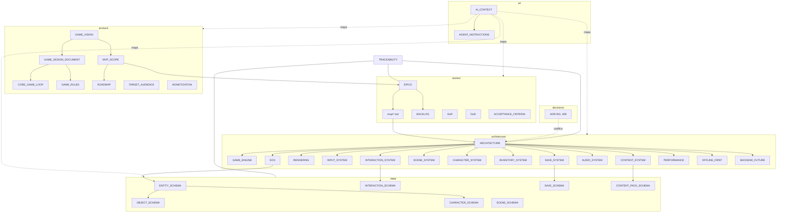

# MyWorld: Documentación

> **Fuente de verdad del proyecto.** Última actualización: 2026-09-18 · Estado: [DOCUMENTATION_STATUS.md](DOCUMENTATION_STATUS.md)

**¿Eres un agente de IA?** Empieza por [ai/AI_CONTEXT.md](ai/AI_CONTEXT.md) y sigue [ai/AGENT_INSTRUCTIONS.md](ai/AGENT_INSTRUCTIONS.md).

## Acceso rápido

| Necesito… | Ir a |
|---|---|
| Entender qué construimos y por qué | [Vision](product/GAME_VISION.md) · [GDD](product/GAME_DESIGN_DOCUMENT.md) |
| Saber qué entra en el MVP | [MVP_SCOPE](product/MVP_SCOPE.md) |
| Ver el plan por fases | [ROADMAP](product/ROADMAP.md) |
| Entender la arquitectura | [ARCHITECTURE](architecture/ARCHITECTURE.md) |
| Formatos de datos (JSON y guardado) | [data/](#data) |
| Epics e historias | [EPICS](stories/EPICS.md) · [BACKLOG](stories/BACKLOG.md) · [MVP_USER_STORIES](stories/MVP_USER_STORIES.md) |
| Decisiones y su porqué | [ADRs](decisions/README.md) |
| Qué implementa cada requisito | [TRACEABILITY](TRACEABILITY.md) |
| Contexto compacto para IA | [AI_CONTEXT](ai/AI_CONTEXT.md) |

## Mapa de la documentación

## Índice completo

### Raíz
- [README.md](README.md): este índice.
- [TRACEABILITY.md](TRACEABILITY.md): matriz Epic → HU → Systems → Schemas → Tests.
- [DOCUMENTATION_STATUS.md](DOCUMENTATION_STATUS.md): estado, preguntas abiertas y siguiente paso.

### product/
| Documento | Contenido |
|---|---|
| [GAME_VISION](product/GAME_VISION.md) | Problema, propuesta, principios, diferenciadores (MVP / POST-MVP / FUTURE) |
| [GAME_DESIGN_DOCUMENT](product/GAME_DESIGN_DOCUMENT.md) | GDD completo (enlaza en lugar de duplicar) |
| [TARGET_AUDIENCE](product/TARGET_AUDIENCE.md) | Segmentos, capacidades, personas |
| [CORE_GAME_LOOP](product/CORE_GAME_LOOP.md) | Macro loop y micro loops (Mermaid) |
| [GAME_RULES](product/GAME_RULES.md) | Reglas de diseño: objetos, personajes, economía, privacidad |
| [MVP_SCOPE](product/MVP_SCOPE.md) | Qué entra y qué no; lista de objetos; criterios de salida |
| [ROADMAP](product/ROADMAP.md) | Fases 0–8 sin fechas |
| [MONETIZATION](product/MONETIZATION.md) | Modelos, propuesta y cumplimiento para niños |

### architecture/
| Documento | Contenido |
|---|---|
| [ARCHITECTURE](architecture/ARCHITECTURE.md) | Capas, carpetas, invariantes, NEEDED NOW frente a LATER |
| [GAME_ENGINE](architecture/GAME_ENGINE.md) | Ciclo de vida, World, comandos, eventos, GameFacade |
| [ECS](architecture/ECS.md) | ECS-lite, catálogo de componentes, Location, Systems y Services |
| [RENDERING](architecture/RENDERING.md) | Skia, resolución virtual, capas, cámara, caché, culling |
| [INPUT_SYSTEM](architecture/INPUT_SYSTEM.md) | Gestos, threads, hit testing, conflictos, superficies |
| [INTERACTION_SYSTEM](architecture/INTERACTION_SYSTEM.md) | Resolución de reglas, casos personaje + X, extensión |
| [SCENE_SYSTEM](architecture/SCENE_SYSTEM.md) | Escenas, zonas, portales, transiciones |
| [CHARACTER_SYSTEM](architecture/CHARACTER_SYSTEM.md) | Capas, poses, manos, ropa, asientos, expresiones |
| [INVENTORY_SYSTEM](architecture/INVENTORY_SYSTEM.md) | Contenedores y mochila |
| [SAVE_SYSTEM](architecture/SAVE_SYSTEM.md) | Autosave, carga, integridad, reinicio |
| [AUDIO_SYSTEM](architecture/AUDIO_SYSTEM.md) | Eventos → sonidos, música, formatos |
| [CONTENT_SYSTEM](architecture/CONTENT_SYSTEM.md) | Registry, pipeline, packs futuros |
| [PERFORMANCE](architecture/PERFORMANCE.md) | Dispositivos de referencia y presupuestos target/warning/critical |
| [OFFLINE_FIRST](architecture/OFFLINE_FIRST.md) | Reglas sin red y preparación para sincronizar |
| [BACKEND_FUTURE](architecture/BACKEND_FUTURE.md) | .NET 8 + PostgreSQL (solo boceto) |

### data/
| Documento | Contenido |
|---|---|
| [ENTITY_SCHEMA](data/ENTITY_SCHEMA.md) | Entidad, IDs, Location y **todos los componentes** |
| [OBJECT_SCHEMA](data/OBJECT_SCHEMA.md) | Prefabs: formato, categorías, ejemplos, validación |
| [CHARACTER_SCHEMA](data/CHARACTER_SCHEMA.md) | Catálogo de partes, componentes de personaje, capas, hitbox |
| [SCENE_SCHEMA](data/SCENE_SCHEMA.md) | Escenas: fondo, suelo, zonas, spawns, entidades |
| [INTERACTION_SCHEMA](data/INTERACTION_SCHEMA.md) | Reglas, condiciones y acciones; reglas del pack core |
| [SAVE_SCHEMA](data/SAVE_SCHEMA.md) | GameSave, tablas SQLite, diff, migraciones |
| [CONTENT_PACK_SCHEMA](data/CONTENT_PACK_SCHEMA.md) | Manifest, assets.json, namespaces, versiones, validación |

### design/
| Documento | Contenido |
|---|---|
| [ART_DIRECTION](design/ART_DIRECTION.md) | Estilo "Soft Paper Toy", paleta, diferenciación |
| [CHARACTER_GUIDELINES](design/CHARACTER_GUIDELINES.md) | Proporciones, lienzo, capas, tintes, poses, expresiones |
| [ENVIRONMENT_GUIDELINES](design/ENVIRONMENT_GUIDELINES.md) | Composición, suelo, chunks, densidad de interacción |
| [ANIMATION_GUIDELINES](design/ANIMATION_GUIDELINES.md) | Presets de tween, personajes, efectos, transiciones |
| [UI_UX_GUIDELINES](design/UI_UX_GUIDELINES.md) | HUD, pantallas, puerta parental, accesibilidad |
| [ASSET_GUIDELINES](design/ASSET_GUIDELINES.md) | Nombres, dimensiones, pivot, padding, WebP, licencias |
| [research/ASSET_MARKET_RESEARCH](design/research/ASSET_MARKET_RESEARCH.md) | Investigación de assets y licencias |
| [research/FREE_ASSETS](design/research/FREE_ASSETS.md) | Kit de assets gratuitos (placeholders) |

### stories/
| Documento | Contenido |
|---|---|
| [EPICS](stories/EPICS.md) | **Lista maestra** de epics e HU (IDs, prioridad, fase, dependencias) |
| [MVP_USER_STORIES](stories/MVP_USER_STORIES.md) | Índice de las 75 HU del MVP → archivos en [mvp/](stories/mvp/) |
| [BACKLOG](stories/BACKLOG.md) | MVP (P0/P1/P2), POST-MVP, FUTURE y estados |
| [POST_MVP_STORIES](stories/POST_MVP_STORIES.md) | HU-GAME-100+ y 200+ (formato breve) |
| [ACCEPTANCE_CRITERIA](stories/ACCEPTANCE_CRITERIA.md) | Convenciones Gherkin y escenarios reutilizables |
| [DEFINITION_OF_READY](stories/DEFINITION_OF_READY.md) · [DEFINITION_OF_DONE](stories/DEFINITION_OF_DONE.md) | DoR y DoD globales |
| [_TEMPLATE_HU](stories/_TEMPLATE_HU.md) | Plantilla de HU |

### decisions/
[Índice de ADRs](decisions/README.md): 001 Stack · 002 Skia · 003 ECS-lite · 004 Datos · 005 Offline · 006 SQLite · 007 Coordenadas · 008 Packs · 009 Threads.

### ai/
| Documento | Contenido |
|---|---|
| [AI_CONTEXT](ai/AI_CONTEXT.md) | **Resumen compacto** para incluir en el contexto de cualquier agente |
| [AGENT_INSTRUCTIONS](ai/AGENT_INSTRUCTIONS.md) | Proceso antes, durante y después de implementar; reglas DO NOT |
| [DEVELOPMENT_RULES](ai/DEVELOPMENT_RULES.md) | No sobre-arquitecturar, invariantes, dependencias, cambios de schema |
| [CODING_GUIDELINES](ai/CODING_GUIDELINES.md) | TypeScript, nombres, estructura, React, tests |
| [GLOSSARY](ai/GLOSSARY.md) | Términos del proyecto |

## Convenciones de esta documentación

- **Encabezado** en cada documento: `Status`, `Last Updated`, `Related ADR / Epic / HU` cuando aplica.
- **Etiquetas de alcance:** `[NEEDED NOW]`, `[DESIGNED FOR LATER]`, `[NOT NEEDED YET]`.
- **Sin duplicar:** cada dato vive en **un** documento y los demás lo enlazan con rutas relativas.
- **Jerarquía ante contradicciones:** ADR > data > architecture > product > stories > AI_CONTEXT.
- **Idioma:** la prosa va en español; los identificadores, el código y los nombres de archivo, en inglés.
