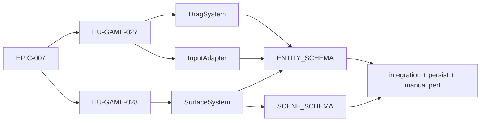

# Traceability Matrix

> **Status:** Living document · **Last Updated:** 2026-09-18
> **Related:** [stories/EPICS.md](stories/EPICS.md) · [architecture/ARCHITECTURE.md](architecture/ARCHITECTURE.md) · [ai/CODING_GUIDELINES.md](ai/CODING_GUIDELINES.md)

**Cadena:** Epic → User Stories → Systems → Schemas → Tests. Permite saber qué parte del sistema implementa cada requisito y qué pruebas lo cubren.

**Tipos de test:**
- `unit`: funciones puras.
- `integration`: harness headless con el World, comandos y `InMemorySaveStore`.
- `persist`: incluye AC-PERSIST-01/02, con recarga desde el SaveStore.
- `scenario`: test de extremo a extremo con el contenido real del pack `core`.
- `content validate`: `npm run content:validate`.
- `manual`: verificación en el dispositivo, documentada en la HU.
- `perf`: medición con el overlay de HU-GAME-071.

**Al cerrar una HU hay que actualizar** la columna *Tests* con las rutas reales de los archivos de test.

## Ejemplo de lectura

```
EPIC-007 Drag & Drop
  ↓
HU-GAME-027 Arrastrar objetos · HU-GAME-028 Soltar sobre superficies
  ↓
DragSystem · InputAdapter (DragProxy) · SurfaceSystem
  ↓
ENTITY_SCHEMA (draggable, surface) · SCENE_SCHEMA (floor)
  ↓
integration (drag + drop + persist) · manual perf
```



## Matriz

| Epic | HU | Systems / módulos | Schemas | Tests |
|---|---|---|---|---|
| EPIC-001 | [HU-GAME-001](stories/mvp/EPIC-001-foundation.md) Configurar el proyecto Expo para el juego | App shell, tooling | — | src/test/app-config.test.ts · lint de capas probado · bundles Android/iOS OK · manual pendiente |
| EPIC-001 | [HU-GAME-002](stories/mvp/EPIC-001-foundation.md) Configurar pruebas unitarias y harness headless | Test harness | — | src/test/harness.test.ts |
| EPIC-001 | [HU-GAME-003](stories/mvp/EPIC-001-foundation.md) Núcleo del World: entidades, componentes y eventos | World, EventBus, LocationService | ENTITY_SCHEMA | src/engine/core/world.test.ts · location-service.test.ts · engine.test.ts |
| EPIC-001 | [HU-GAME-004](stories/mvp/EPIC-001-foundation.md) GameFacade: puente UI ↔ motor | GameFacade, hooks | — | src/game/facade.test.tsx |
| EPIC-002 | [HU-GAME-005](stories/mvp/EPIC-002-rendering.md) Canvas Skia con resolución virtual | RenderAdapter (Canvas, escala) | — | src/engine/adapters/adapters-pure.test.ts · manual pendiente |
| EPIC-002 | [HU-GAME-006](stories/mvp/EPIC-002-rendering.md) Renderizar entidades por capas y orden z | RenderAdapter (capas, z) | ENTITY_SCHEMA (sprite) | src/engine/scene/scene.test.ts (render order) · src/game/facade.test.tsx · manual pendiente |
| EPIC-002 | [HU-GAME-007](stories/mvp/EPIC-002-rendering.md) Cámara horizontal con paneo | RenderAdapter (cámara), InputAdapter (pan) | SCENE_SCHEMA (bounds) | src/engine/scene/scene.test.ts (camera) · src/engine/core/engine.test.ts (cameraSettled) · manual pendiente |
| EPIC-002 | [HU-GAME-008](stories/mvp/EPIC-002-rendering.md) Culling y carga de fondos por chunks | RenderAdapter (culling, chunks), AssetLoader | SCENE_SCHEMA (background) | src/engine/scene/scene.test.ts (culling) · adapters-pure.test.ts (TextureCache) · perf pendiente |
| EPIC-002 | [HU-GAME-009](stories/mvp/EPIC-002-rendering.md) Tweens y animaciones simples | RenderAdapter (tweens) | ENTITY_SCHEMA (animations) | src/engine/systems/visual-effects.test.ts · manual pendiente |
| EPIC-003 | [HU-GAME-010](stories/mvp/EPIC-003-scenes.md) Cargar una escena declarada en JSON | SceneService, ContentRegistry | SCENE_SCHEMA | integration load scene |
| EPIC-003 | [HU-GAME-011](stories/mvp/EPIC-003-scenes.md) Instanciar entidades desde prefabs con overrides | SceneService, ContentRegistry (merge) | OBJECT_SCHEMA, SCENE_SCHEMA | unit merge + integration |
| EPIC-003 | [HU-GAME-012](stories/mvp/EPIC-003-scenes.md) Zonas (habitaciones) dentro de una escena | SceneService (zones) | SCENE_SCHEMA (zones) | unit zoneAt |
| EPIC-004 | [HU-GAME-013](stories/mvp/EPIC-004-characters.md) Renderizar un personaje por capas | CharacterSystem, RenderAdapter | CHARACTER_SCHEMA | unit selectCharacterLayers + manual |
| EPIC-004 | [HU-GAME-014](stories/mvp/EPIC-004-characters.md) Poses del personaje | CharacterSystem | CHARACTER_SCHEMA (pose) | unit poses |
| EPIC-004 | [HU-GAME-015](stories/mvp/EPIC-004-characters.md) Expresiones faciales | CharacterSystem | CHARACTER_SCHEMA (expression) | unit timers |
| EPIC-004 | [HU-GAME-016](stories/mvp/EPIC-004-characters.md) Sostener objetos en las manos | HoldSystem, InteractionResolver | INTERACTION_SCHEMA (hold), CHARACTER_SCHEMA | integration hold |
| EPIC-004 | [HU-GAME-017](stories/mvp/EPIC-004-characters.md) Arrastrar personajes | DragSystem, CharacterSystem, SeatSystem | CHARACTER_SCHEMA | integration drag character |
| EPIC-005 | [HU-GAME-018](stories/mvp/EPIC-005-creator.md) Abrir el creador y elegir cuerpo y tono de piel | Creator UI, GameFacade (createCharacter) | CHARACTER_SCHEMA (parts) | integration + manual |
| EPIC-005 | [HU-GAME-019](stories/mvp/EPIC-005-creator.md) Elegir ojos y boca | Creator UI | CHARACTER_SCHEMA | integration |
| EPIC-005 | [HU-GAME-020](stories/mvp/EPIC-005-creator.md) Elegir peinado y color de pelo | Creator UI, RenderAdapter (tint) | CHARACTER_SCHEMA | integration + manual |
| EPIC-005 | [HU-GAME-021](stories/mvp/EPIC-005-creator.md) Elegir ropa inicial | Creator UI, OutfitSystem | CHARACTER_SCHEMA, OBJECT_SCHEMA (wearable) | integration |
| EPIC-005 | [HU-GAME-022](stories/mvp/EPIC-005-creator.md) Guardar, listar y editar personajes | Creator UI, SaveService | CHARACTER_SCHEMA, SAVE_SCHEMA | integration persist |
| EPIC-005 | [HU-GAME-023](stories/mvp/EPIC-005-creator.md) Colocar personajes creados en el mundo | GameFacade, SceneService | CHARACTER_SCHEMA | integration |
| EPIC-006 | [HU-GAME-024](stories/mvp/EPIC-006-objects.md) Registro de prefabs de objetos con validación | ContentRegistry | OBJECT_SCHEMA | unit validation |
| EPIC-006 | [HU-GAME-025](stories/mvp/EPIC-006-objects.md) Estados de objetos y sprites por estado | StateSystem, RenderAdapter | ENTITY_SCHEMA (states) | unit |
| EPIC-006 | [HU-GAME-026](stories/mvp/EPIC-006-objects.md) Hitbox y hit testing | InputAdapter (hit test) | ENTITY_SCHEMA (hitbox) | unit hit test |
| EPIC-007 | [HU-GAME-027](stories/mvp/EPIC-007-drag-drop.md) Arrastrar objetos | DragSystem, InputAdapter (DragProxy) | ENTITY_SCHEMA (draggable) | integration + manual perf |
| EPIC-007 | [HU-GAME-028](stories/mvp/EPIC-007-drag-drop.md) Soltar objetos sobre superficies y el suelo | SurfaceSystem | ENTITY_SCHEMA (surface), SCENE_SCHEMA (floor) | unit surface + persist |
| EPIC-007 | [HU-GAME-029](stories/mvp/EPIC-007-drag-drop.md) Auto-scroll de la cámara al arrastrar cerca del borde | InputAdapter, RenderAdapter (cámara) | — | manual |
| EPIC-007 | [HU-GAME-030](stories/mvp/EPIC-007-drag-drop.md) Los objetos apoyados se mueven con su mueble | SurfaceSystem, LocationService | ENTITY_SCHEMA (transform.parentId) | integration |
| EPIC-008 | [HU-GAME-031](stories/mvp/EPIC-008-interaction.md) Resolver interacciones mediante reglas de datos | InteractionResolver, ActionExecutor | INTERACTION_SCHEMA | unit resolver + integration |
| EPIC-008 | [HU-GAME-032](stories/mvp/EPIC-008-interaction.md) Interacciones por tap | InteractionResolver (tap) | INTERACTION_SCHEMA | integration |
| EPIC-008 | [HU-GAME-033](stories/mvp/EPIC-008-interaction.md) Resaltar el destino válido durante el arrastre | InteractionResolver.preview, RenderAdapter | INTERACTION_SCHEMA (feedback) | unit preview + manual |
| EPIC-009 | [HU-GAME-034](stories/mvp/EPIC-009-containers.md) Abrir y cerrar muebles | ContainerSystem, StateSystem | ENTITY_SCHEMA (openable) | integration persist |
| EPIC-009 | [HU-GAME-035](stories/mvp/EPIC-009-containers.md) Guardar objetos en contenedores | ContainerSystem, LocationService | ENTITY_SCHEMA (container), SAVE_SCHEMA | integration persist |
| EPIC-009 | [HU-GAME-036](stories/mvp/EPIC-009-containers.md) Sacar objetos de contenedores | ContainerSystem, DragSystem | ENTITY_SCHEMA (container) | integration |
| EPIC-010 | [HU-GAME-037](stories/mvp/EPIC-010-inventory.md) Guardar objetos en la mochila | InventorySystem, HUD | SAVE_SCHEMA (inventory) | integration persist |
| EPIC-010 | [HU-GAME-038](stories/mvp/EPIC-010-inventory.md) Sacar objetos de la mochila | InventorySystem, HUD | SAVE_SCHEMA | integration |
| EPIC-011 | [HU-GAME-039](stories/mvp/EPIC-011-clothing.md) Vestir prendas soltándolas sobre el personaje | OutfitSystem | OBJECT_SCHEMA (wearable), CHARACTER_SCHEMA | integration persist |
| EPIC-011 | [HU-GAME-040](stories/mvp/EPIC-011-clothing.md) Quitar prendas del personaje | OutfitSystem, InputAdapter | CHARACTER_SCHEMA | integration |
| EPIC-011 | [HU-GAME-041](stories/mvp/EPIC-011-clothing.md) Armario con ropa disponible | ContainerSystem, OutfitSystem | OBJECT_SCHEMA | integration |
| EPIC-012 | [HU-GAME-042](stories/mvp/EPIC-012-food.md) Comer alimentos por mordiscos | ConsumeSystem, CharacterSystem | ENTITY_SCHEMA (edible) | integration persist |
| EPIC-012 | [HU-GAME-043](stories/mvp/EPIC-012-food.md) Beber bebidas | ConsumeSystem | ENTITY_SCHEMA (drinkable) | integration persist |
| EPIC-012 | [HU-GAME-044](stories/mvp/EPIC-012-food.md) Dispensadores de objetos | SpawnSystem | ENTITY_SCHEMA (spawner) | integration |
| EPIC-013 | [HU-GAME-045](stories/mvp/EPIC-013-furniture.md) Sentarse en asientos | SeatSystem, CharacterSystem | ENTITY_SCHEMA (seat) | integration persist |
| EPIC-013 | [HU-GAME-046](stories/mvp/EPIC-013-furniture.md) Dormir en camas | SeatSystem, CharacterSystem | ENTITY_SCHEMA (bed) | integration persist |
| EPIC-013 | [HU-GAME-047](stories/mvp/EPIC-013-furniture.md) Objetos encendibles (lámpara, TV, grifo) | StateSystem | ENTITY_SCHEMA (switchable) | integration persist |
| EPIC-013 | [HU-GAME-048](stories/mvp/EPIC-013-furniture.md) Mover muebles | DragSystem, SurfaceSystem, SeatSystem | ENTITY_SCHEMA (draggable floorOnly) | integration |
| EPIC-014 | [HU-GAME-049](stories/mvp/EPIC-014-navigation.md) Puertas y portales entre escenas | SceneService, InteractionResolver (teleport) | ENTITY_SCHEMA (portal), SCENE_SCHEMA | integration persist |
| EPIC-014 | [HU-GAME-050](stories/mvp/EPIC-014-navigation.md) Transición entre escenas | SceneService, RenderAdapter, AudioService | SCENE_SCHEMA | integration + perf |
| EPIC-014 | [HU-GAME-051](stories/mvp/EPIC-014-navigation.md) Mapa de ubicaciones | Map UI, SceneService | CONTENT_PACK_SCHEMA (locations), SCENE_SCHEMA (zones) | integration + manual |
| EPIC-015 | [HU-GAME-052](stories/mvp/EPIC-015-save.md) Autoguardado del mundo en SQLite | SaveService, DirtyTracker, SqliteSaveStore | SAVE_SCHEMA | integration persist |
| EPIC-015 | [HU-GAME-053](stories/mvp/EPIC-015-save.md) Restaurar la partida al iniciar | SaveService, SceneService | SAVE_SCHEMA | integration |
| EPIC-015 | [HU-GAME-054](stories/mvp/EPIC-015-save.md) Versionado y migraciones de guardado | SaveService (migrations) | SAVE_SCHEMA §5 | unit migrations |
| EPIC-015 | [HU-GAME-055](stories/mvp/EPIC-015-save.md) Reiniciar el mundo | SaveService, Settings UI | SAVE_SCHEMA | integration |
| EPIC-016 | [HU-GAME-056](stories/mvp/EPIC-016-audio.md) Sonidos de interacción | AudioService | ENTITY_SCHEMA (sounds) | unit mapping + manual |
| EPIC-016 | [HU-GAME-057](stories/mvp/EPIC-016-audio.md) Música y ambiente por ubicación | AudioService, SceneService (zones) | SCENE_SCHEMA (audio) | unit + manual |
| EPIC-016 | [HU-GAME-058](stories/mvp/EPIC-016-audio.md) Control de volumen y silencio | AudioService, Settings UI | SAVE_SCHEMA (settings) | integration persist |
| EPIC-017 | [HU-GAME-059](stories/mvp/EPIC-017-home.md) Salón jugable | Contenido core:home (living) | OBJECT_SCHEMA, SCENE_SCHEMA | content validate + scenario |
| EPIC-017 | [HU-GAME-060](stories/mvp/EPIC-017-home.md) Cocina jugable | Contenido core:home (kitchen) | OBJECT_SCHEMA, SCENE_SCHEMA, INTERACTION_SCHEMA | content validate + scenario |
| EPIC-017 | [HU-GAME-061](stories/mvp/EPIC-017-home.md) Dormitorio jugable | Contenido core:home (bedroom) | OBJECT_SCHEMA, SCENE_SCHEMA | content validate + scenario |
| EPIC-017 | [HU-GAME-062](stories/mvp/EPIC-017-home.md) Baño jugable | Contenido core:home (bathroom) | OBJECT_SCHEMA, SCENE_SCHEMA | content validate + scenario |
| EPIC-018 | [HU-GAME-063](stories/mvp/EPIC-018-street.md) Calle jugable | Contenido core:street | SCENE_SCHEMA | content validate + scenario |
| EPIC-019 | [HU-GAME-064](stories/mvp/EPIC-019-store.md) Tienda jugable | Contenido core:store, EconomySystem | SCENE_SCHEMA, ENTITY_SCHEMA (purchasable) | content validate + scenario |
| EPIC-020 | [HU-GAME-065](stories/mvp/EPIC-020-economy.md) Monedero de monedas | EconomySystem, HUD | SAVE_SCHEMA (wallet) | integration persist |
| EPIC-020 | [HU-GAME-066](stories/mvp/EPIC-020-economy.md) Comprar objetos | EconomySystem, InteractionResolver | INTERACTION_SCHEMA (purchase), ENTITY_SCHEMA (purchasable) | integration persist |
| EPIC-020 | [HU-GAME-067](stories/mvp/EPIC-020-economy.md) Regalo diario y monedas escondidas | EconomySystem | ENTITY_SCHEMA (collectible), SAVE_SCHEMA (dailyReward) | integration persist |
| EPIC-021 | [HU-GAME-068](stories/mvp/EPIC-021-content.md) Pack "core" con manifest y namespaces | ContentRegistry, asset map generator | CONTENT_PACK_SCHEMA | integration load pack |
| EPIC-022 | [HU-GAME-070](stories/mvp/EPIC-022-accessibility.md) Objetivos táctiles grandes y UI sin texto | HUD, UI | — | manual @a11y |
| EPIC-023 | [HU-GAME-071](stories/mvp/EPIC-023-performance.md) Overlay de rendimiento y verificación de presupuestos | Perf overlay | — | manual @performance |
| EPIC-024 | [HU-GAME-069](stories/mvp/EPIC-024-testing.md) Validador de contenido para la CLI y la CI | validate-content CLI | CONTENT_PACK_SCHEMA + todos los schemas | unit validator |
| EPIC-024 | [HU-GAME-072](stories/mvp/EPIC-024-testing.md) Pruebas de regresión de guardado con fixtures | SaveService (migrations) | SAVE_SCHEMA | fixture regression |
| EPIC-026 | [HU-GAME-073](stories/mvp/EPIC-026-app-shell.md) Pantalla de inicio | Title UI, GameFacade | SAVE_SCHEMA | integration + manual |
| EPIC-026 | [HU-GAME-074](stories/mvp/EPIC-026-app-shell.md) Puerta parental | Parental gate UI | — | unit + manual |
| EPIC-026 | [HU-GAME-075](stories/mvp/EPIC-026-app-shell.md) Pantalla de ajustes | Settings UI | SAVE_SCHEMA (settings) | integration persist |

## Cobertura por sistema (vista inversa)

| System / Service | HU principales |
|---|---|
| World | HU-GAME-003 |
| GameFacade | HU-GAME-004, HU-GAME-018, HU-GAME-023, HU-GAME-073 |
| RenderAdapter | HU-GAME-005, HU-GAME-006, HU-GAME-007, HU-GAME-008, HU-GAME-009, HU-GAME-013, HU-GAME-020, HU-GAME-025, HU-GAME-029, HU-GAME-033, HU-GAME-050 |
| InputAdapter | HU-GAME-007, HU-GAME-026, HU-GAME-027, HU-GAME-029, HU-GAME-040 |
| SceneService | HU-GAME-010, HU-GAME-011, HU-GAME-012, HU-GAME-023, HU-GAME-049, HU-GAME-050, HU-GAME-051, HU-GAME-053, HU-GAME-057 |
| ContentRegistry | HU-GAME-010, HU-GAME-011, HU-GAME-024, HU-GAME-068 |
| CharacterSystem | HU-GAME-013, HU-GAME-014, HU-GAME-015, HU-GAME-017, HU-GAME-042, HU-GAME-045, HU-GAME-046 |
| HoldSystem | HU-GAME-016 |
| DragSystem | HU-GAME-017, HU-GAME-027, HU-GAME-036, HU-GAME-048 |
| SurfaceSystem | HU-GAME-028, HU-GAME-030, HU-GAME-048 |
| InteractionResolver | HU-GAME-016, HU-GAME-031, HU-GAME-032, HU-GAME-033, HU-GAME-049, HU-GAME-066 |
| StateSystem | HU-GAME-025, HU-GAME-034, HU-GAME-047 |
| ContainerSystem | HU-GAME-034, HU-GAME-035, HU-GAME-036, HU-GAME-041 |
| InventorySystem | HU-GAME-037, HU-GAME-038 |
| OutfitSystem | HU-GAME-021, HU-GAME-039, HU-GAME-040, HU-GAME-041 |
| ConsumeSystem | HU-GAME-042, HU-GAME-043 |
| SpawnSystem | HU-GAME-044 |
| SeatSystem | HU-GAME-017, HU-GAME-045, HU-GAME-046, HU-GAME-048 |
| SaveService | HU-GAME-022, HU-GAME-052, HU-GAME-053, HU-GAME-054, HU-GAME-055, HU-GAME-072 |
| AudioService | HU-GAME-050, HU-GAME-056, HU-GAME-057, HU-GAME-058 |
| EconomySystem | HU-GAME-064, HU-GAME-065, HU-GAME-066, HU-GAME-067 |

## POST-MVP

La trazabilidad de las HU-GAME-100+ se añade al refinarlas (ver [POST_MVP_STORIES](stories/POST_MVP_STORIES.md)).
