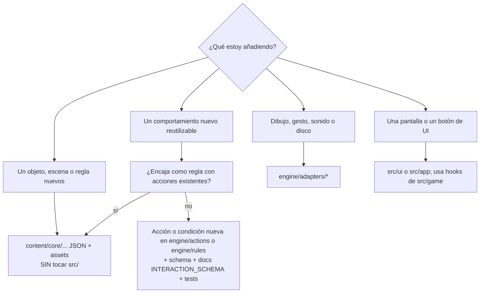

# Agent Instructions (Claude Code, Codex y otros)

> **Status:** Accepted · **Last Updated:** 2026-09-18
> **Related:** [AI_CONTEXT](AI_CONTEXT.md) · [DEVELOPMENT_RULES](DEVELOPMENT_RULES.md) · [CODING_GUIDELINES](CODING_GUIDELINES.md)

## 1. Antes de implementar (siempre)

1. Leer [docs/ai/AI_CONTEXT.md](AI_CONTEXT.md).
2. Leer el **documento de arquitectura** relevante (`docs/architecture/*`) y el **schema** relevante (`docs/data/*`).
3. Leer el **Epic** correspondiente ([EPICS.md](../stories/EPICS.md)) y su archivo en [stories/mvp/](../stories/mvp/).
4. Leer la **HU** completa: reglas, criterios, casos límite, dependencias y DoD.
5. Comprobar el [Definition of Ready](../stories/DEFINITION_OF_READY.md). Si no se cumple, **detente e informa** qué falta. No inventes el comportamiento.
6. **Inspeccionar la implementación existente** (`MyWorld/src`, `MyWorld/content`) antes de crear nada nuevo. Busca systems, acciones, helpers o componentes que ya existan.
7. **Implementar solo el alcance pedido.**
8. Ejecutar los tests (`npm test`), el lint y los tipos (`npm run lint`, `npx tsc --noEmit`) y la validación de contenido (`npm run content:validate`) cuando existan.
9. **Actualizar la documentación** si cambió la arquitectura, un schema o una convención. Incluye el `Last Updated` y [TRACEABILITY](../TRACEABILITY.md).
10. Informar del resultado:
    - qué se hizo;
    - qué tests se añadieron;
    - qué se verificó a mano o **no** se pudo verificar (por ejemplo, un dispositivo físico);
    - qué documentos se tocaron.

## 2. Reglas duras

- **DO NOT** inventar arquitectura nueva sin documentarla (con un ADR si afecta a los invariantes de [ARCHITECTURE §6](../architecture/ARCHITECTURE.md)).
- **DO NOT** hardcodear comportamiento específico de un objeto si un componente reutilizable puede representarlo.
- **DO NOT** introducir dependencias sin justificarlas (en la HU o en un ADR; ver [DEVELOPMENT_RULES §3](DEVELOPMENT_RULES.md)).
- **DO NOT** cambiar schemas públicos sin considerar migraciones (`saveVersion`, `formatVersion`, `idAliases`).
- **DO NOT** duplicar sistemas. Si algo parecido ya existe, extiéndelo.
- **DO NOT** acoplar el contenido del juego a la implementación del render (nada de coordenadas ni rutas en componentes).
- **DO NOT** implementar funcionalidades fuera de la HU solicitada. Anota las ideas en [BACKLOG](../stories/BACKLOG.md) como sugerencia.
- **DO NOT** borrar código ni documentación existente sin analizarlo antes y explicar por qué.
- **DO NOT** usar assets con licencia no permitida ([ASSET_GUIDELINES §8](../design/ASSET_GUIDELINES.md)).

## 3. Cómo elegir dónde va el código



## 4. Formato de entrega (resumen al terminar)

```
HU: HU-GAME-0XX — <título>
Hecho: <lista breve>
Tests: <nuevos/actualizados> — resultado
Verificación manual: <qué y en qué plataforma> | NO VERIFICADO: <qué y por qué>
Docs actualizados: <rutas>
Pendiente/Riesgos: <si hay>
```

## 5. Si encuentras una contradicción entre documentos

1. No la resuelvas en silencio.
2. Aplica la jerarquía: **ADR > docs/data > docs/architecture > docs/product > stories > AI_CONTEXT**.
3. Informa de la contradicción y propón el cambio documental. Si está en tu alcance y es trivial (un typo, un enlace), corrígelo e indícalo.
