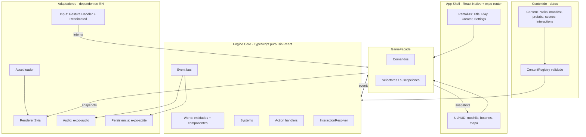
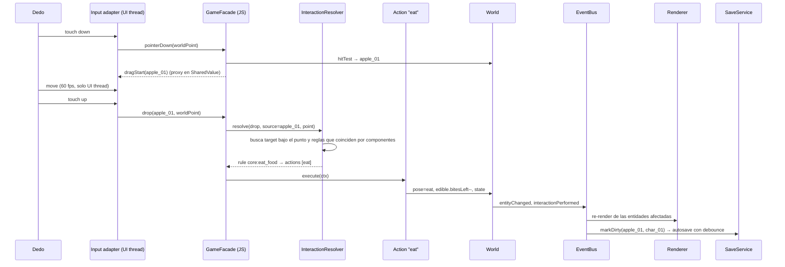

# Arquitectura general

> **Status:** Accepted (v1) · **Last Updated:** 2026-09-18
> **Related ADR:** [ADR-001](../decisions/ADR-001-TECH-STACK.md), [ADR-002](../decisions/ADR-002-RENDERING.md), [ADR-003](../decisions/ADR-003-ECS.md), [ADR-004](../decisions/ADR-004-DATA-DRIVEN-CONTENT.md), [ADR-005](../decisions/ADR-005-OFFLINE-FIRST.md), [ADR-009](../decisions/ADR-009-STATE-AND-THREADING.md)
> **Related Epic:** EPIC-001, EPIC-002, EPIC-003

Este documento es el **mapa**. El detalle de cada sistema está en su propio documento.

## 1. Resumen en una frase

Un **motor ligero en TypeScript puro** que funciona sin React. Su pieza central es un `World` de entidades con componentes, y los sistemas reaccionan a comandos y eventos. Alrededor del motor hay adaptadores finos:

- **Skia** para dibujar.
- **Gesture Handler + Reanimated** para la entrada táctil.
- **SQLite** para guardar.
- **React Native** para la UI.

Todo el contenido (objetos, escenas, interacciones) se define con **datos JSON validados**, agrupados en **Content Packs**.

> **Dónde está el arte:** el del juego va en `MyWorld/content/<pack>/assets/`. Los placeholders CC0 descargados están en `assets/vendor/`, en la **raíz del repositorio**, fuera de la app. Se copian y renombran al pack cuando se usan (ver [ASSET_GUIDELINES §7](../design/ASSET_GUIDELINES.md)).

## 2. Capas



### Reglas de dependencia (NO negociables)

| Capa | Puede importar | NO puede importar |
|---|---|---|
| `engine/core`, `engine/systems`, `engine/actions`, `engine/content` | TypeScript puro y `zod` | `react`, `react-native`, `@shopify/react-native-skia`, `expo-*` |
| `engine/adapters/*` (render, input, audio, persistence) | core + la librería que adaptan | UI (`ui/`, `app/`) |
| `game/` (facade, hooks) | core + adapters | pantallas |
| `ui/`, `app/` | `game/` (facade y hooks) | `engine/core` directamente ❌ |

**Consecuencia:** el motor completo se prueba con Jest en Node, sin emulador (ver [HU-GAME-002](../stories/mvp/EPIC-001-foundation.md)).

## 3. Estructura de carpetas

La app vive en `MyWorld/`. La documentación vive en `docs/`, en la raíz del repositorio.

```
MyWorld/
  app.json                 # orientation: landscape (ver ADR-007)
  src/
    app/                   # rutas expo-router: index (Title), play, creator, settings
    ui/                    # componentes RN de UI/HUD (sin lógica de juego)
    game/                  # GameFacade, store bindings (useSyncExternalStore), hooks
    engine/
      core/                # World, Entity, ComponentRegistry, EventBus, CommandBus, ids
      components/          # tipos + schemas zod de cada componente
      systems/             # DragSystem, InteractionSystem, ContainerSystem, ...
      actions/             # handlers de acciones: eat, sit, wear, store, open, teleport...
      rules/               # InteractionResolver
      scene/               # SceneLoader, SceneState (diff), zonas
      content/             # ContentRegistry, carga de packs, validación
      persistence/         # SaveService, serializer, migraciones (sin SQL)
      adapters/
        render/            # Skia: SceneCanvas, capas, cámara, culling
        input/             # gestures → intents, hit testing en coordenadas del mundo
        audio/             # expo-audio
        sqlite/            # repositorio SQLite (implementa el puerto SaveStore)
    test/                  # harness headless, fixtures, builders
  content/
    core/                  # Content Pack "core" (manifest, prefabs, scenes, interactions, i18n)
  assets/                  # SOLO iconos de la app y splash (plantilla Expo). El arte del juego vive en content/<pack>/assets/
  scripts/
    validate-content.ts    # validador de packs (HU-GAME-069)
```

La estructura se crea en [HU-GAME-001](../stories/mvp/EPIC-001-foundation.md). Una carpeta nueva de primer nivel necesita justificación documentada.

## 4. Flujo de una interacción típica

Ejemplo: soltar una manzana en la boca de un personaje.



## 5. Conceptos clave (definiciones cortas)

| Concepto | Definición | Documento |
|---|---|---|
| **Entity** | ID estable + conjunto de componentes. No tiene lógica. | [ECS](ECS.md) |
| **Component** | Datos serializables con un schema zod. No tiene lógica. | [ECS](ECS.md), [ENTITY_SCHEMA](../data/ENTITY_SCHEMA.md) |
| **Prefab** | Plantilla de entidad definida en un Content Pack (por ejemplo `core:apple_red`). | [OBJECT_SCHEMA](../data/OBJECT_SCHEMA.md) |
| **Location** | Dónde está una entidad: en la escena, en un contenedor, en la mochila, en la mano o vestida. Es única por entidad. | [ENTITY_SCHEMA](../data/ENTITY_SCHEMA.md) |
| **System** | Módulo que reacciona a comandos o eventos y modifica componentes. | [GAME_ENGINE](GAME_ENGINE.md) |
| **Action** | Operación atómica y reutilizable (`eat`, `sit`, `store`…) que ejecutan las reglas. | [INTERACTION_SYSTEM](INTERACTION_SYSTEM.md) |
| **Interaction Rule** | Dato que dice: "si el origen tiene X y el destino tiene Y, con este trigger → estas acciones". | [INTERACTION_SCHEMA](../data/INTERACTION_SCHEMA.md) |
| **Scene** | Espacio jugable declarado en JSON. Tiene fondo, tamaño, zonas, spawn points y entidades. | [SCENE_SCHEMA](../data/SCENE_SCHEMA.md) |
| **Scene State** | Diferencia entre la escena definida y lo que el jugador cambió. Es lo que se guarda. | [SAVE_SYSTEM](SAVE_SYSTEM.md) |
| **Content Pack** | Paquete versionado de contenido con namespace. | [CONTENT_SYSTEM](CONTENT_SYSTEM.md) |
| **World units** | Coordenadas virtuales: la escena mide 1080 unidades de alto. | [RENDERING](RENDERING.md), [ADR-007](../decisions/ADR-007-VIRTUAL-COORDINATES.md) |

## 6. Invariantes: lo que NO debe cambiar sin un ADR nuevo

1. **El núcleo del motor no depende de React, React Native, Skia ni Expo.**
2. **No hay lógica específica por objeto.** Los comportamientos salen de componentes y reglas de interacción. Está prohibido escribir `if (prefabId === 'apple')`.
3. **Cada entidad tiene exactamente una `location`.** Mover una entidad significa cambiar su location mediante un sistema.
4. **Los IDs de contenido llevan namespace (`pack:id`) y son estables.** Renombrar un ID exige un alias de migración.
5. **Las coordenadas del mundo son unidades virtuales** con escena de alto 1080, origen arriba a la izquierda, y ejes x hacia la derecha e y hacia abajo. Todo el contenido usa este sistema. Los píxeles de pantalla solo existen en el adaptador de render e input.
6. **El guardado es un diff sobre la escena definida**, con `saveVersion` y migraciones obligatorias.
7. **La UI solo habla con el motor a través del GameFacade** (comandos + selectores).
8. **La animación de alta frecuencia (drag y tweens) vive en el UI thread.** El estado lógico vive en el World, en el JS thread. Ver [ADR-009](../decisions/ADR-009-STATE-AND-THREADING.md).
9. **El contenido del MVP es un Content Pack más (`core`).** El motor no conoce qué objetos existen.

## 7. Qué se construye ahora y qué no

| Tema | Estado |
|---|---|
| World, componentes, EventBus, CommandBus | [NEEDED NOW] |
| InteractionResolver basado en reglas + acciones registradas | [NEEDED NOW] |
| Pack `core` empaquetado en el binario | [NEEDED NOW] |
| Autoguardado SQLite (un solo slot) + migraciones | [NEEDED NOW] |
| Culling por viewport + fondos en chunks | [NEEDED NOW] (Fase 1) |
| Varios slots de guardado | [DESIGNED FOR LATER]: la columna `slot_id` ya existe |
| Packs descargables, verificación de firma | [DESIGNED FOR LATER] |
| Atlas o spritesheets (`drawAtlas`) | [DESIGNED FOR LATER]: solo si las mediciones lo exigen |
| Variantes de assets @2x para tablets | [DESIGNED FOR LATER] |
| Backend .NET, cloud saves, cuentas | [NOT NEEDED YET] |
| Motor de físicas, pathfinding, scripting propio | [NOT NEEDED YET]: no se deben introducir |
| ECS por arquetipos o librería ECS externa | [NOT NEEDED YET]: ver [ADR-003](../decisions/ADR-003-ECS.md) |

## 8. Documentos por sistema

- [GAME_ENGINE.md](GAME_ENGINE.md): ciclo de vida, comandos, eventos y lista de sistemas.
- [ECS.md](ECS.md): modelo entidad-componente y catálogo de componentes.
- [RENDERING.md](RENDERING.md): Skia, capas, cámara, resolución virtual y culling.
- [INPUT_SYSTEM.md](INPUT_SYSTEM.md): gestos, hit testing y conflictos.
- [INTERACTION_SYSTEM.md](INTERACTION_SYSTEM.md): reglas, acciones y resolución.
- [SCENE_SYSTEM.md](SCENE_SYSTEM.md): carga, zonas, portales y transiciones.
- [CHARACTER_SYSTEM.md](CHARACTER_SYSTEM.md): capas, poses, manos, ropa y expresiones.
- [INVENTORY_SYSTEM.md](INVENTORY_SYSTEM.md): contenedores y mochila.
- [SAVE_SYSTEM.md](SAVE_SYSTEM.md): persistencia, diff y migraciones.
- [AUDIO_SYSTEM.md](AUDIO_SYSTEM.md): efectos de sonido, música y volumen.
- [CONTENT_SYSTEM.md](CONTENT_SYSTEM.md): packs, registry y validación.
- [PERFORMANCE.md](PERFORMANCE.md): presupuestos y cómo medirlos.
- [OFFLINE_FIRST.md](OFFLINE_FIRST.md): funcionamiento sin red.
- [BACKEND_FUTURE.md](BACKEND_FUTURE.md): futuro backend (.NET 8 + PostgreSQL).
