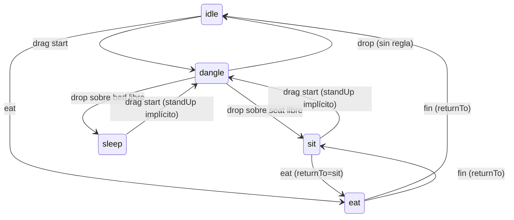

# Character System

> **Status:** Accepted (v1) · **Last Updated:** 2026-09-18
> **Related ADR:** [ADR-002](../decisions/ADR-002-RENDERING.md), [ADR-003](../decisions/ADR-003-ECS.md)
> **Related Epic:** EPIC-004, EPIC-005, EPIC-011, EPIC-012, EPIC-013
> **Related HU:** HU-GAME-013 a HU-GAME-023, HU-GAME-039 a HU-GAME-046
> **Schema:** [CHARACTER_SCHEMA](../data/CHARACTER_SCHEMA.md) · **Arte:** [CHARACTER_GUIDELINES](../design/CHARACTER_GUIDELINES.md)

## 1. Enfoque: personaje por capas, sin esqueleto

Un personaje es una pila de sprites 2D que comparten pivot. Cada capa elige su sprite según cuatro datos:
- el **tipo de cuerpo**,
- la **pose**,
- la **apariencia** (partes elegidas),
- la **ropa vestida**.

| Alternativa | Por qué no en el MVP |
|---|---|
| Rig esquelético (Spine, DragonBones) | Licencia y runtime adicionales, más trabajo de arte y más complejidad en React Native. [DESIGNED FOR LATER] si la animación lo exige. |
| Sprite sheet por combinación | La explosión combinatoria lo hace imposible con personajes personalizables |
| Capas + poses por sprite + tweens | ✅ Barato, compatible con la personalización, y la animación sale de tweens sencillos |

## 2. Orden de render

Es el orden fijo de [CHARACTER_SCHEMA §3](../data/CHARACTER_SCHEMA.md):

```
shadow → hairBack → legs → bottomClothes → shoes → torso → torsoClothes
→ armL → armClothesL → heldL → armR → armClothesR → heldR
→ head → eyes → mouth → hairFront → accessories
```

- El personaje se dibuja como **un solo `Group` de Skia** con la transformación del `transform`. Las capas son hijas de ese grupo.
- El `z` del personaje dentro de la capa `characters` se calcula como `transform.y`: quien está más abajo en pantalla se dibuja delante.
- Si el personaje está sentado, se usa el `z` del asiento + 1 (ver [RENDERING §4](RENDERING.md)).

## 3. Resolución de sprites por capa

```
spriteFor(layer, character):
  pose = character.pose.current
  1. capa de cuerpo  → catalog.bodyTypes[bodyType].layers[pose][layer] ?? layers.idle[layer]
  2. capa de ropa    → wearable.bodyVariants[bodyType][layer] ?? wearable.layers[layer]  (de la prenda en ese slot)
                       variante por pose opcional: clave "{asset}_{pose}" si existe en el manifest; si no, la de idle
  3. pelo            → hairStyles[hairStyle].byBodyType[bodyType] ?? hairStyles[hairStyle]
  4. ojos            → expression ∈ {sleepy} o pose ∈ {sleep} ? closedAsset : asset
  5. boca            → mouths[mouth].byExpression[expression] ?? asset
  6. held            → sprite del objeto sostenido, colocado en handAnchors[pose][hand]
```

El resultado es un **selector puro y memoizado** (`selectCharacterLayers(world, id)`). Solo se recalcula cuando cambian los componentes del personaje o de sus prendas.

## 4. Personalización: tintes frente a sprites coloreados

- **Piel y pelo se pintan en escala de grises** (con sombreado incluido) y se **tiñen en runtime** con Skia: `ColorMatrix` o `BlendMode.Multiply`, según lo que decida el spike de la Fase 1.
- Así 8 tonos de piel × N partes cuestan **N sprites**, no 8N.
- **La ropa viene coloreada**, un sprite por prenda. Así los estampados se ven bien. [DESIGNED FOR LATER]: variantes de color con tinte.
- ⚠️ **Pregunta abierta (spike en la Fase 1):** comprobar la calidad del tinte con el estilo de arte final. Plan B: sprites de piel pre-coloreados, con más peso de assets.

## 5. Poses

| Pose | Tipo | Cuándo | Visual |
|---|---|---|---|
| `idle` | persistente | por defecto | de pie, respiración suave (tween de escala Y ±1,5 %) |
| `dangle` | temporal | mientras se arrastra | piernas colgando, balanceo por velocidad horizontal (tween en el UI thread) |
| `sit` | persistente | acción `sit` | sprites `legs`/`torso` de sentado, anclado en `seat.anchor` |
| `sleep` | persistente | acción `sleep` | sprite de acostado + ojos cerrados. La cama puede dibujar una manta delante (ver `bed.coverAsset` en §8) |
| `eat` | temporal (unos 900 ms) | acción `eat` | brazo a la boca + boca `yum` + efecto de migas, y vuelve a `returnTo` |
| `drink` | temporal (unos 900 ms) | acción `drink` | igual, con sorbo |

**Reglas:**
- Las poses temporales guardan `returnTo`. Si el personaje empieza a arrastrarse durante una pose temporal, se cancela y pasa a `dangle`.
- Al soltar un personaje sin regla aplicable, queda en `idle` apoyado en el suelo o en una superficie.

## 6. Sostener objetos

1. La acción `hold` elige la mano así:
   - La de la **zona** tocada (`handL` o `handR`), si está libre.
   - Si se tocó `body`, primero la **derecha** y después la izquierda.
   - Si no, la otra mano libre.
   - Si ninguna está libre, la condición `handFree` falla.
2. El objeto sostenido **se dibuja dentro del grupo del personaje**, en `heldL`/`heldR`, a escala 0,8 y alineado en `handAnchors[pose][hand]`.
3. Al arrastrar el personaje, lo que sostiene va con él. Al viajar por un portal, **viaja con él** (location `held` intacta).
4. Arrastrar el objeto sostenido lo saca de la mano (ver [INTERACTION_SYSTEM §5](INTERACTION_SYSTEM.md)).
5. Comer o beber **algo que ya se sostiene** [DESIGNED FOR LATER]: tocar el objeto en la mano → `eat`. En el MVP solo se come arrastrando la comida a la boca.

## 7. Ropa

- Al **vestir** (`wear`):
  - La prenda pasa a `location: worn`.
  - La que ocupaba el slot pasa a la escena, junto a los pies del personaje, con una animación de "pop".
- Al **quitar** (HU-GAME-040): **pulsación larga** (≥ 450 ms) sobre la prenda puesta. El motor ejecuta la regla `unwear_clothes` con la zona tocada (`torso`/`legs`/`feet` → slot) y la acción `unwear` devuelve `startDrag`, así que el dedo sigue arrastrando la prenda sin levantarlo.
- **Cambio de `bodyType`** en el creador: la ropa vestida **se conserva**. Cada `wearable` debe tener sprites para los dos tipos de cuerpo (`bodyVariants` o sprites neutros). Si falta alguno, el validador emite un **error** para la ropa de inicio y una advertencia para el resto.
- El **creador** (EPIC-005) edita `appearance`. En cuanto a la ropa, crea instancias de los prefabs `starterClothes` y las viste. No existe una "ropa del creador" separada: es la misma ropa del mundo.

## 8. Asientos y camas



- La ocupación se deriva: un asiento está ocupado si algún personaje tiene `pose.seatId === seatId`.
- Si se arrastra un mueble **con alguien sentado** (HU-GAME-048), el personaje se mueve con él: su transform se deriva del anchor.
- `bed.coverAsset?: AssetKey` [NEEDED NOW]: una manta que se dibuja **delante** del personaje dormido, en la capa `characters` justo después de él (ver [RENDERING §4](RENDERING.md)).

## 9. Expresiones

- `setExpression(expr, durationMs)` cambia la expresión y fija `untilMs`.
- `CharacterSystem.tick` vuelve a `neutral` cuando se cumple el plazo. Ese tick no corre cada frame: es un `setTimeout` por personaje, que se cancela si cambia la expresión.
- Expresiones v1: `neutral`, `happy`, `surprised`, `sleepy`, `yum`, `curious`. Ver [CHARACTER_GUIDELINES](../design/CHARACTER_GUIDELINES.md).

| Evento | Expresión automática |
|---|---|
| tap en el personaje | `happy` (1,5 s) |
| comer o beber | `yum` (durante la pose) |
| empezar a arrastrarlo | `surprised` (mientras dura `dangle`) |
| dormir | `sleepy` (ojos cerrados) |
| recibir una prenda | `happy` (1 s) |

## 10. NPCs [DESIGNED FOR LATER] (EPIC-027)

Un NPC es un personaje con `character.isNpc = true` y un componente `npcBehavior`. Se renderiza con el mismo sistema. En el MVP no hay NPCs; la tienda funciona con una caja registradora (`checkout`) sin tendero.
