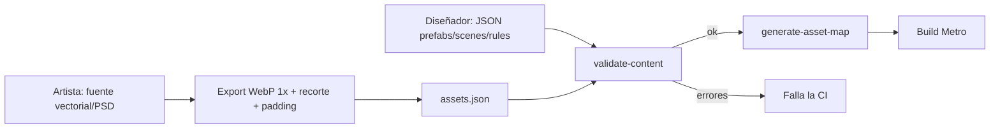

# Content System

> **Status:** Accepted (v1) · **Last Updated:** 2026-09-18
> **Related ADR:** [ADR-004](../decisions/ADR-004-DATA-DRIVEN-CONTENT.md), [ADR-008](../decisions/ADR-008-CONTENT-PACKS.md)
> **Related Epic:** EPIC-021, EPIC-024
> **Related HU:** HU-GAME-068, HU-GAME-069, HU-GAME-024 · POST-MVP: HU-GAME-114
> **Schema:** [CONTENT_PACK_SCHEMA](../data/CONTENT_PACK_SCHEMA.md)

## 1. Principio

El motor **no conoce** ningún objeto, escena ni regla concretos. Todo llega desde **Content Packs**, y el contenido del MVP es el pack `core`.

- El pack `core` va **empaquetado en el binario** [NEEDED NOW].
- Los packs descargables son [DESIGNED FOR LATER].

## 2. ContentRegistry

```ts
interface ContentRegistry {
  packs(): PackManifest[];
  prefab(id: PrefabId): PrefabDefinition;           // lanza error en dev si no existe
  scene(id: SceneId): SceneDefinition;
  rules(): InteractionRule[];                        // ya con namespace e indexadas
  characterParts(): CharacterPartsCatalog;           // fusión de las partes de todos los packs
  asset(key: AssetKey): AssetRef;                    // { pack, file, w, h }
  audio(key: AudioKey): AudioRef;
  t(key: I18nKey, locale): string;
  resolveAlias(id: string): string;                  // aplica idAliases
}
```

**Carga (en el arranque):**
1. Descubrir los packs:
   - MVP: una lista estática generada en el build (`content/index.ts` con los `require`).
   - Futuro: además, el directorio de descargas.
2. Ordenar topológicamente según `dependencies`.
3. Validar cada pack:
   - **en dev:** validación zod completa;
   - **en release:** solo el manifest y los schemas, porque las referencias cruzadas ya las validó la CI. Esto reduce el tiempo de arranque (ver PERFORMANCE).
4. Registrar con namespace y construir el índice de reglas.

**Cómo se empaqueta en el MVP:** los JSON se importan con `require` (Metro los bundlea). Las imágenes y el audio se referencian con `require` en un **mapa generado** (`content/core/assets.generated.ts`), que produce un script a partir de `assets.json`. Metro necesita `require` estáticos, así que el script de generación forma parte de HU-GAME-068.

## 3. Pipeline de contenido



## 4. Cómo añadir un objeto (receta)

1. Exportar los sprites según [ASSET_GUIDELINES](../design/ASSET_GUIDELINES.md) a `content/core/assets/images/`.
2. Registrarlos en `content/core/assets.json`.
3. Crear `content/core/prefabs/<category>/<id>.json` con sus componentes.
4. Añadir las claves i18n a `locales/es.json` y `locales/en.json`.
5. Colocarlo en una escena (`scenes/*.json`) o hacerlo disponible en la tienda.
6. Ejecutar `npm run content:validate`.
7. **No hace falta tocar `src/`.** Si parece que sí, revisa [INTERACTION_SYSTEM §7](INTERACTION_SYSTEM.md).

## 5. Packs futuros sin tocar el motor [DESIGNED FOR LATER]

| Pack | Aporta | Necesita capacidades nuevas del motor |
|---|---|---|
| School | Escenas de aula y patio, pupitres (`seat`), pizarra (`states`), mochila escolar (`container`) | No |
| Beach | Escena de playa, toallas (`bed` con pose "tumbado"), helados (`edible`) | No |
| Hospital | Camillas (`bed`), botiquín (`container`) | Quizás una pose nueva: el set de poses es contenido del catálogo, pero el tipo `PoseId` es del motor |
| Pets | Mascotas | **Sí**: componente `pet` y PetSystem (EPIC-028) |
| Restaurant | Cocina, mesas, comida | No (combinar comida → EPIC-030) |
| Space | Escenas y objetos | No (salvo gravedad lúdica, que queda fuera del alcance) |

**Enlazar packs con el mundo existente:**
- Cada pack declara `provides.locations` y el mapa los muestra automáticamente.
- Para colocar puntos de acceso en escenas de otro pack (una parada de autobús en la calle de `core`) se usan **extensiones de escena** (`extends` + `addEntities`, ver [CONTENT_PACK_SCHEMA §7](../data/CONTENT_PACK_SCHEMA.md)). **No hace falta modificar `core`.**

**Distribución futura** (HU-GAME-114): descarga desde un CDN o el backend, verificación de `checksum` y de la firma, almacenamiento en `FileSystem.documentDirectory/packs/<id>/<version>/` y derecho de uso (entitlement) mediante IAP.

## 6. Qué NO hacer

- ❌ Poner rutas de archivos en prefabs o escenas. Se usan claves de asset.
- ❌ Poner texto visible en los JSON. Se usan claves i18n.
- ❌ Referenciar un pack que no está en `dependencies`.
- ❌ Reutilizar un ID eliminado.
- ❌ Hacer que el motor importe archivos de `content/` por ruta. Solo lo hace el registry generado.
