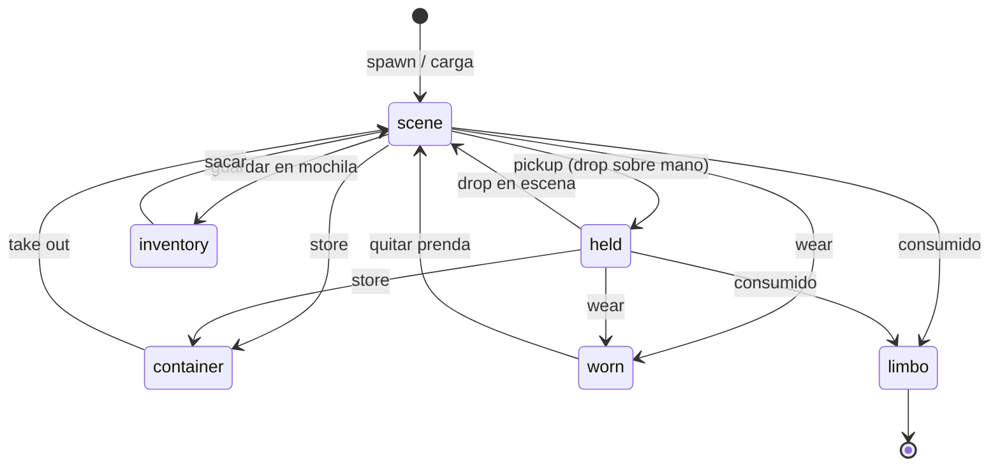

# ECS-lite: modelo de entidades, componentes y sistemas

> **Status:** Accepted (v1) · **Last Updated:** 2026-09-18
> **Related ADR:** [ADR-003](../decisions/ADR-003-ECS.md)
> **Related Epic:** EPIC-001, EPIC-006, EPIC-008
> **Schemas:** [ENTITY_SCHEMA](../data/ENTITY_SCHEMA.md), [OBJECT_SCHEMA](../data/OBJECT_SCHEMA.md)

## 1. Análisis de la propuesta original

La propuesta inicial, un ECS clásico con sistemas que recorren entidades cada frame, **acierta en lo importante**: composición, datos y cero lógica por objeto. Pero no encaja bien con este juego, por cuatro razones:

| Aspecto | ECS clásico | Nuestra realidad | Decisión |
|---|---|---|---|
| Frecuencia de lógica | Todos los sistemas se ejecutan en cada frame | La lógica ocurre **en eventos discretos**: tocar, soltar, abrir. Entre eventos no pasa nada. | Sistemas **dirigidos por eventos y comandos**. No hay un bucle lógico por frame. |
| Volumen | Miles de entidades, rendimiento por caché y arquetipos | Unas 50-300 entidades por escena | Mapas simples `Map<EntityId, Entity>`. **Sin librería ECS**. |
| Animación | Un sistema de animación en el game loop | Reanimated/Skia animan en el UI thread | Las animaciones son **efectos visuales** que dispara el motor, no lógica por frame. |
| Varios "sistemas" propuestos | Save, Audio, Scene como sistemas ECS | Son **servicios** con I/O, no transformaciones de componentes | Se separan **Systems** (lógica de juego) y **Services** (I/O). |

**Resultado: "ECS-lite".** Tiene:

- Entidades como datos con componentes serializables.
- Systems puros que reaccionan a comandos y eventos.
- Actions reutilizables invocadas por reglas de interacción.
- Services para I/O en los bordes.

Hay un único "tick" opcional (`TimeSystem`) [DESIGNED FOR LATER] para temporizadores de gameplay: regalo diario, dispensadores con cooldown. Se ejecuta a baja frecuencia (1 Hz o al reanudar la app), nunca a 60 fps.

## 2. Entity

```ts
type EntityId = string;                // estable; ver ENTITY_SCHEMA para el formato
interface Entity {
  id: EntityId;
  prefabId?: PrefabId;                 // "core:apple_red"; ausente en entidades puramente de escena
  tags: string[];                      // "food", "fruit", "kitchen" → usados por reglas y filtros
  location: Location;                  // ÚNICA fuente de verdad de dónde está
  components: Partial<ComponentMap>;   // solo datos
}
```

- La entidad **no tiene métodos**.
- Todo cambio pasa por `World.update(id, patch)` o por las APIs del sistema correspondiente. Eso emite `entityChanged`.

## 3. Catálogo de componentes (v1)

Esta es la **fuente de verdad de los nombres**. Los schemas detallados de cada componente están en [ENTITY_SCHEMA.md](../data/ENTITY_SCHEMA.md#componentes).

| Componente | Responsabilidad | Ejemplos | Sistema dueño | Estado |
|---|---|---|---|---|
| `transform` | Posición (x, y) en world units, `flipX`, `scale`, `parentId` opcional | Todas las entidades visibles en escena | Core / DragSystem | [NEEDED NOW] |
| `sprite` | Asset por defecto, `layer`, `z`, `pivot`, sprites por estado | Todas las visibles | RenderAdapter | [NEEDED NOW] |
| `hitbox` | Forma tocable + **zonas nombradas** (`mouth`, `handL`, `handR`, `torso`…) | Objetos y personajes | InputAdapter / hit testing | [NEEDED NOW] |
| `draggable` | Se puede arrastrar; `mode: free \| floorOnly`; peso visual | Manzana, silla, personaje | DragSystem | [NEEDED NOW] |
| `surface` | Segmentos horizontales donde se apoyan otros objetos | Mesa, estante, cama, suelo | SurfaceSystem | [NEEDED NOW] |
| `states` | Máquina de estados finita simple: `current` + lista de estados | Nevera abierta/cerrada, lámpara on/off | StateSystem | [NEEDED NOW] |
| `openable` | Vincula `states` con abrir y cerrar; `openState`, `closedState` | Nevera, armario, caja | ContainerSystem | [NEEDED NOW] |
| `container` | Capacidad, slots, filtros por tags, `requiresOpen` | Nevera, armario, caja de juguetes | ContainerSystem | [NEEDED NOW] |
| `switchable` | Vincula `states` con encender y apagar: `onState`, `offState` | Lámpara, TV, grifo | StateSystem | [NEEDED NOW] |
| `animations` | Evento → preset visual (`bounce`, `wiggle`, `squash`); solo presentación | Cualquiera | RenderAdapter | [NEEDED NOW] (P1) |
| `edible` | Mordiscos restantes, sprite por mordisco, qué pasa al terminar | Manzana, pastel | ConsumeSystem | [NEEDED NOW] |
| `drinkable` | Sorbos restantes y prefab al vaciarse | Jugo, leche | ConsumeSystem | [NEEDED NOW] |
| `wearable` | Slot de ropa y capas de sprite para vestir | Camisa, zapatos | OutfitSystem | [NEEDED NOW] |
| `seat` | Punto de anclaje, pose y ocupante | Silla, sofá, inodoro | SeatSystem | [NEEDED NOW] |
| `bed` | Punto de anclaje para dormir y ocupante | Cama | SeatSystem (misma lógica, otra pose) | [NEEDED NOW] |
| `portal` | Escena y spawn de destino | Puerta de casa, puerta de tienda | SceneService | [NEEDED NOW] (Fase 2) |
| `spawner` | Genera instancias de un prefab al tocarlo (máximo, cooldown) | Frutero, dispensador de agua | SpawnSystem | [NEEDED NOW] |
| `spawnedFrom` | `spawnerId` del dispensador que creó la entidad (para contar `maxAlive`). Se persiste. | Manzana del frutero | SpawnSystem | [NEEDED NOW] |
| `purchasable` | Precio en monedas; "no comprado" mientras está en la tienda | Productos de la tienda | EconomySystem | [NEEDED NOW] (Fase 2) |
| `collectible` | Otorga monedas u objetos al tocarlo una vez | Moneda escondida | EconomySystem | [NEEDED NOW] (P2) |
| `sounds` | Mapa evento → clave de sonido (`pickup`, `drop`, `use`) | Cualquiera | AudioService | [NEEDED NOW] |
| `character` | Marca de personaje: `characterId`, nombre, `isNpc` | Personajes | CharacterSystem | [NEEDED NOW] |
| `appearance` | Cuerpo, piel, ojos, boca, pelo, color de pelo | Personajes | CharacterSystem | [NEEDED NOW] |
| `outfit` | Slot de ropa → EntityId de la prenda vestida | Personajes | OutfitSystem | [NEEDED NOW] |
| `holder` | Manos y qué entidad sostiene cada una | Personajes | HoldSystem | [NEEDED NOW] |
| `pose` | Pose actual (`idle`, `dangle`, `sit`, `sleep`, `eat`, `drink`) + referencia al asiento | Personajes | CharacterSystem | [NEEDED NOW] |
| `expression` | Expresión actual + temporizador para volver a la neutral | Personajes | CharacterSystem | [NEEDED NOW] (P1) |
| `combinable` | Participa en recetas (A + B → C) | Pan + queso | CraftSystem | [DESIGNED FOR LATER] (EPIC-030) |
| `pet` | Comportamiento de mascota | Perro, gato | PetSystem | [DESIGNED FOR LATER] (EPIC-028) |
| `npcBehavior` | Rutinas simples (idle, saludar, atender) | Tendero | NpcSystem | [DESIGNED FOR LATER] (EPIC-027) |
| `memoryTrigger` | Crea un recuerdo cuando ocurre algo | Primer pastel | MemorySystem | [DESIGNED FOR LATER] (EPIC-029) |
| `secret` | Condición para revelar un secreto | Cuadro que se mueve | SecretSystem | [DESIGNED FOR LATER] (EPIC-031) |

**Para añadir un componente nuevo** se requiere todo lo siguiente:
1. Un schema zod en `engine/components/`.
2. Una fila en esta tabla.
3. Su sección en [ENTITY_SCHEMA.md](../data/ENTITY_SCHEMA.md).
4. Revisar si cambia el formato de guardado. Si cambia, hace falta una migración (ver [SAVE_SYSTEM](SAVE_SYSTEM.md)).

## 4. Location: dónde está una entidad

La location es el **invariante central** del modelo. Una entidad está exactamente en uno de estos lugares:

```ts
type Location =
  | { kind: 'scene';     sceneId: SceneId }                         // usa transform para x,y
  | { kind: 'container'; containerId: EntityId; slot: number }
  | { kind: 'inventory'; slot: number }                             // mochila global
  | { kind: 'held';      holderId: EntityId; hand: 'left' | 'right' }
  | { kind: 'worn';      characterId: EntityId; slot: WearSlot }
  | { kind: 'limbo' };                                              // consumida o pendiente de borrar (no se guarda)
```

- Los sistemas **nunca** duplican la relación. Por ejemplo, `holder.left` es un índice derivado de las entidades con `location.kind === 'held'`.
- Si guardaran la relación en dos sitios, habría que sincronizarla, y eso es la fuente clásica de bugs de "objeto duplicado o perdido".
- **Regla de implementación:** los índices derivados se reconstruyen en `World` (`world.index.heldBy(holderId)`) y **no se persisten**.
- Cambiar la location **siempre** pasa por `LocationService.move(entityId, newLocation)`. Este servicio:
  - valida la transición, por ejemplo que el contenedor tenga espacio;
  - actualiza los índices;
  - emite `entityMoved { from, to }`.



## 5. Systems y Services

### Systems (lógica de juego pura, sin I/O)

| System | Reacciona a | Hace |
|---|---|---|
| `DragSystem` | `dragStart`, `dragEnd` | Valida si se puede arrastrar, levanta el objeto del asiento o contenedor si aplica y aplica la colocación final |
| `SurfaceSystem` | `dropResolved` sin regla | Calcula la superficie de apoyo bajo el punto (o el suelo) y ajusta la `y` |
| `InteractionSystem` | `drop`, `tap` | Llama al `InteractionResolver` y ejecuta las acciones de la regla ganadora |
| `StateSystem` | acción `setState` / `cycleState` | Cambia `states.current` |
| `ContainerSystem` | acciones `open`, `close`, `store`, `takeOut` | Abrir y cerrar, insertar y extraer |
| `HoldSystem` | acción `hold`, `release` | Manos del personaje |
| `OutfitSystem` | acción `wear`, `unwear` | Vestir y desvestir |
| `ConsumeSystem` | acción `eat`, `drink` | Resta mordiscos o sorbos y gestiona el final |
| `SeatSystem` | acción `sit`, `sleep`, `standUp` | Ocupar y liberar asientos y camas |
| `SpawnSystem` | acción `spawn` | Instancia prefabs (y añade `spawnedFrom`) |
| `InventorySystem` | acciones `addToInventory` y comando `takeFromInventory` | Slots de la mochila (location `inventory`) |
| `EconomySystem` | acción `purchase`, `collect` | Monedero, compras y recompensas |
| `CharacterSystem` | cambios de pose y expresión | Pose derivada, expresión con temporizador |

### Services (bordes, con I/O o dependencias externas)

| Service | Responsabilidad | Documento |
|---|---|---|
| `ContentRegistry` | Carga y valida packs y resuelve prefabs | [CONTENT_SYSTEM](CONTENT_SYSTEM.md) |
| `SceneService` | Carga y descarga escenas, aplica el diff guardado y gestiona los portales | [SCENE_SYSTEM](SCENE_SYSTEM.md) |
| `SaveService` | Dirty tracking, autosave con debounce, carga y migraciones | [SAVE_SYSTEM](SAVE_SYSTEM.md) |
| `AudioService` | Escucha eventos y reproduce efectos de sonido y música | [AUDIO_SYSTEM](AUDIO_SYSTEM.md) |
| `LocationService` | Única vía para cambiar la `location` | Este documento, §4 |

## 6. Ejemplos de composición

```
apple_red (prefab core:apple_red)
  tags: [food, fruit]
  transform, sprite, hitbox, draggable, edible{bites:3}, sounds{eat:"sfx_eat_crunch"}

chair_wood (core:chair_wood)
  tags: [furniture]
  transform, sprite, hitbox, draggable{mode:"floorOnly"}, seat{anchor, pose:"sit"}

bed_single (core:bed_single)
  tags: [furniture]
  transform, sprite, hitbox, surface, bed{anchor}

fridge (core:fridge)
  tags: [furniture, appliance]
  transform, sprite, hitbox, states{closed|open}, openable, container{capacity:6, requiresOpen:true, accepts:["food","drink"]}

shirt_star (core:shirt_star)
  tags: [clothing]
  transform, sprite, hitbox, draggable, wearable{slot:"top"}

character (runtime, creado por el jugador)
  tags: [character]
  transform, hitbox{zones: head, mouth, handL, handR, body}, draggable, character, appearance, outfit, holder, pose, expression
```

Ninguno de estos objetos necesita código propio. Todo el comportamiento sale de las [reglas de interacción](INTERACTION_SYSTEM.md).

## 7. Anti-patrones prohibidos

- ❌ `if (entity.prefabId === 'core:bed')`. Usa el componente `bed`.
- ❌ Componentes con funciones o referencias a objetos vivos (imágenes, sonidos). Los componentes guardan **claves** de assets, no los assets.
- ❌ Un sistema que modifica componentes que pertenecen a otro sistema sin pasar por su API o acción.
- ❌ Estado de juego dentro de componentes React (`useState` con posiciones, contenido de contenedores…).
- ❌ Guardar una misma relación en dos lugares. Ver §4.
