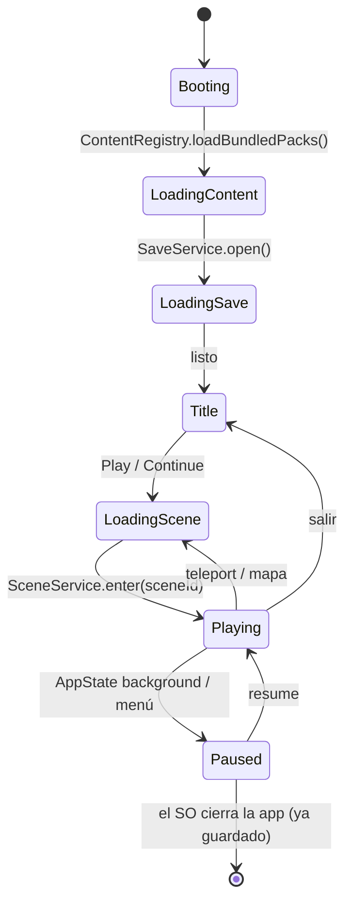

# Game Engine

> **Status:** Accepted (v1) · **Last Updated:** 2026-09-18
> **Related ADR:** [ADR-003](../decisions/ADR-003-ECS.md), [ADR-009](../decisions/ADR-009-STATE-AND-THREADING.md)
> **Related Epic:** EPIC-001
> **Related HU:** HU-GAME-002, HU-GAME-003, HU-GAME-004

## 1. Responsabilidades del motor

- Mantener el **World**: las entidades de la escena activa y las entidades globales.
- Recibir **comandos** (intenciones del jugador o de la UI) y procesarlos de forma **síncrona y determinista**.
- Emitir **eventos** de dominio para el render, el audio, el guardado y la UI.
- **No** dibujar, **no** reproducir sonido, **no** tocar SQLite. Eso lo hacen los adaptadores.

## 2. Ciclo de vida



- `GameEngine.create({ content, saveStore, clock, random, logger })` recibe **todas** sus dependencias inyectadas. Esto lo hace testeable y determinista: `clock` y `random` son falsificables en los tests.
- No hay singletons globales. La app crea **una** instancia y la expone mediante un contexto React en `game/`.

## 3. World

```ts
interface World {
  get(id: EntityId): Readonly<Entity> | undefined;
  query(filter: { has?: ComponentName[]; tags?: string[]; sceneId?: SceneId; locationKind?: Location['kind'] }): Readonly<Entity>[];
  index: {                                    // índices derivados, NO persistidos
    heldBy(holderId): EntityId[];
    wornBy(characterId): Partial<Record<WearSlot, EntityId>>;
    inContainer(containerId): (EntityId | null)[];
    inventory(): (EntityId | null)[];
    seatOccupant(seatId): EntityId | undefined;
  };
  // mutación: solo desde systems/actions
  create(entity: Entity): void;
  update(id: EntityId, patch: ComponentPatch): void;   // cada clave REEMPLAZA el componente completo; null lo elimina
  setLocation(id, location): boolean;          // interno: solo LocationService
  remove(id: EntityId): void;
  transaction<T>(fn: () => T): T;            // agrupa los eventos y los emite al final
}
```

- **Inmutabilidad hacia fuera:** `get` y `query` devuelven objetos `Readonly`. Internamente se aplican `patch` con copia superficial por componente (structural sharing) para que los selectores con `===` sean baratos.
- En memoria están:
  - las entidades de la **escena activa**;
  - las **globales**: **todos** los personajes (≤ 12) con lo que sostienen y visten, y el contenido de la mochila.

  Los personajes se cargan siempre porque la lista de personajes de la UI los necesita, aunque su `location` sea una escena concreta. **Solo se renderizan y son tocables los de la escena activa.** Las demás escenas existen solo en el guardado y en el contenido.

## 4. Comandos (entrada al motor)

Todos los comandos pasan por el `GameFacade` (§6). La UI y el Input **nunca** llaman a los systems directamente.

| Comando | Origen | Efecto |
|---|---|---|
| `pointerTap { worldPoint }` | Input | hit test → InteractionResolver (`tap`) |
| `pointerLongPress { worldPoint, minHitWorld? }` | Input (450 ms sin moverse < 10 dp) | hit test → InteractionResolver (`longPress`). Si una acción entrega `startDrag` (v1: `unwear`), el drag de ese objeto empieza ya y devuelve `{ ok, startDrag }`; `dragCancel` lo devuelve a su location |
| `dragStart { entityId, worldPoint }` | Input | DragSystem valida y libera (standUp, takeOut, release) |
| `dragPreview { entityId, worldPoint, uiTarget?, minHitWorld? }` | Input (muestreo ≤ 10 Hz durante el drag) | `resolver.preview` (pura) → evento `dropPreview { sourceId, targetId?, zone?, ruleId?, ok, reason?, highlight, rejectHint? }`, solo cuando cambia el resultado. Fallo: `notDragging` |
| `dragEnd { entityId, worldPoint, uiTarget? }` | Input | InteractionResolver (`drop`) o `place` |
| `dragCancel { entityId }` | Input (gesto cancelado) | Deshace las transiciones de `dragStart` y vuelve a la location y posición originales |
| `cameraSettled { cameraX, viewportW }` | Input o Render (fin del paneo o de la inercia, fin del auto-scroll o de un salto de zona) | Actualiza `player.cameraX` (limitado a los bounds; por eso lleva `viewportW`, que el motor no conoce) y la zona activa. **No** se envía por frame. |
| `viewportChanged { viewportW }` | Render (al medir la Canvas o rotar) | Guarda el ancho visible en world units para centrar la cámara inicial de cada escena ([SCENE_SYSTEM §2](SCENE_SYSTEM.md), paso 6). Sin viewport conocido, la cámara inicial usa la x del spawn. |
| `enterScene { sceneId, spawnId, travelers? }` | Carga de partida, puertas | Descarga la escena activa (eventos `entityRemoved` con `unload: true`), instancia la nueva (prefab ⊕ overrides ⊕ diff guardado) y emite `sceneLoaded { cameraX }`. Fallos: `noContent`, `unknownScene`. |
| `enterScene { sceneId, spawnId }` | UI (mapa) o acción `teleport` | SceneService |
| `createCharacter { appearance, outfit }` | Creator UI | Crea el personaje en el spawn `default` de la escena activa (desplazado 120 u si está ocupado) y una instancia `worn` por prenda, en una transacción. Devuelve `{ ok: true, entityId }`. Fallos: `maxCharacters` (12), `invalidPart`, `noActiveScene` |
| `updateAppearance { characterId, patch }` | Creator UI | Actualiza solo los campos del `patch` (recalcula sprite y hitbox si cambia el cuerpo). No toca location, pose ni ropa. Fallos: `entityNotFound`, `notCharacter`, `invalidPart` |
| `setOutfitSlot { characterId, slot, prefabId \| null }` | Creator UI (modo edición) | Viste una instancia nueva del prefab. La prenda anterior va al **armario** si hay espacio o, si no, a los pies del personaje |
| `focusEntity { entityId }` | UI (lista de personajes, vuelta del creador) | Si la entidad está en otra escena, entra en ella; después emite `focusRequested { entityId, x }` y la vista anima la cámara como un salto de zona |
| `takeFromInventory { slot, worldPoint }` | HUD | Inventario → escena en el punto del dedo e inicia el drag (`{ ok, startDrag, entityId }`); `dragCancel` lo devuelve a su slot. Fallos: `entityNotFound` (slot vacío), `alreadyDragging` |
| `claimDailyGift {}` | Title o HUD (al entrar en Play) | Si `player.dailyReward.lastClaimDate` ≠ hoy (fecha local), suma `newGame.dailyGiftCoins` y guarda la fecha |
| `setSetting { key, value }` | Settings UI | Actualiza `player.settings` (`musicVolume`/`sfxVolume` 0..1 en pasos de 0,1, `muted`) y emite `playerChanged { keys: ['settings'] }`. Fallo: `invalidCommand` |
| `resetWorld { keepCharacters }` | Settings (parental) | SaveService.reset |

## 5. Eventos (salida del motor)

| Evento | Payload | Consumidores |
|---|---|---|
| `entityCreated` / `entityChanged` / `entityRemoved` | `{ id, components? }` | Render, DirtyTracker |
| `entityMoved` | `{ id, from: Location, to: Location }` | Render, Audio (pickup/drop), DirtyTracker |
| `interactionPerformed` | `{ ruleId, sourceId?, targetId?, uiTarget?, actions }` | Audio, animaciones, HUD (bounce de la mochila), futuros recuerdos y analytics |
| `interactionRejected` | `{ ruleId?, reason, sourceId?, targetId?, uiTarget? }` | Feedback (shake del target o del botón de la HUD + sonido "nop") |
| `dropPreview` | `{ targetId?, ok, reason? }` | Resaltado (HU-GAME-033) |
| `sceneWillChange` / `sceneLoaded` | `{ from?, to }` | Transición, Audio, SaveService (flush) |
| `walletChanged` | `{ coins, delta }` | HUD, SaveService (flush inmediato) |
| `playerChanged` | `{ keys }` | UI de ajustes, DirtyTracker |
| `visualEffect` | `{ entityId, preset }` | Render (tweens de `animations`) |
| `zoneChanged` | `{ sceneId, zoneId? }` | Audio (música o ambiente de la zona), UI |
| `focusRequested` | `{ entityId, x }` | Render (cámara). Solo presentación |
| `pickedUp` / `dropped` | `{ entityId }` / `{ entityId, placed }` | Audio (pickup/drop). Solo presentación |
| `walletChanged` | `{ coins, delta }` | HUD, Audio (moneda) |

- Los eventos son **datos**: nada de funciones ni referencias vivas.
- Se emiten **después** de terminar la transacción, **en un único lote** (`EventBus.subscribe(listener(batch))`): los consumidores reaccionan una vez por transacción.
- `sceneLoaded` lo emite hoy `GameEngine.activateScene` (provisional hasta HU-GAME-010).

## 6. GameFacade

Es el único punto de contacto entre la UI y el motor.

```ts
interface GameFacade {
  // comandos
  dispatch(cmd: GameCommand): CommandResult;
  // lectura (para useSyncExternalStore)
  subscribe(listener: () => void): () => void;           // notificación genérica
  subscribeEntity(id: EntityId, listener: () => void): () => void;   // granular, para el render
  getSnapshot(): GameSnapshot;                            // referencias estables si no hay cambios
  selectors: {
    visibleEntities(viewport): EntityRenderData[];        // ya resuelto para el render (sprite por estado, z, capa)
    characterLayers(id): CharacterLayerData[];
    inventorySlots(): InventorySlotView[];
    wallet(): number;
    activeZone(): ZoneId | undefined;
    settings(): Settings;
    characters(): CharacterSummary[];
    characterCatalog(): CharacterPartsCatalog;                    // opciones del creador
    previewCharacterLayers(draft: { appearance; outfit: Partial<Record<WearSlot, PrefabId>> }): CharacterLayerData[];  // vista previa sin crear entidad
  };
  events: EventBus;                                       // suscripción de audio y efectos
  getEntity(id): Entity | undefined;                      // lectura puntual (useEntity)
  setAssetSizeLookup(fn): void;                           // tamaños nativos para el culling (lo configura la vista de escena)
  dev: { activateScene(scene, entities); playEffect(id, preset) };  // SOLO sandbox y menús de depuración
}
```

- **Hooks React** en `game/hooks`: `useEntity(id)`, `useVisibleEntities()`, `useWallet()`, `useInventory()`, `useSettings()`. Se implementan con `useSyncExternalStore`.
- **Sin librería de estado externa** (Redux, Zustand) en el MVP. `useSyncExternalStore` cubre la necesidad. Ver [ADR-009](../decisions/ADR-009-STATE-AND-THREADING.md).

## 7. Determinismo y pruebas

- Mismo estado + mismo comando + mismo `clock`/`random` ⇒ mismo resultado. Esto permite **tests de escenario**:

```ts
const game = createTestGame({ packs: [corePackFixture], scene: 'core:home' });
game.dispatch({ type: 'dragStart', entityId: 'core:home/apple_1', worldPoint: p(2580, 780) });
game.dispatch({ type: 'dragEnd',   entityId: 'core:home/apple_1', worldPoint: mouthOf(game, charId) });
expect(game.world.get('core:home/apple_1')!.components.edible!.bitesLeft).toBe(2);
```

- El harness (`src/test/`) lo crea [HU-GAME-002](../stories/mvp/EPIC-001-foundation.md).

## 8. Errores

- Un comando inválido (entidad inexistente, drag de algo no arrastrable) **no lanza excepción** hacia la UI. Devuelve `CommandResult { ok: false, reason }` y, si procede, emite `interactionRejected`.
- Las **violaciones de invariantes** (location inválida, doble ocupación):
  - en dev lanzan un error con un mensaje claro;
  - en producción se reparan de forma segura y se registran (`logger.warn`).
- **Nunca** hay una pantalla roja para el niño.
