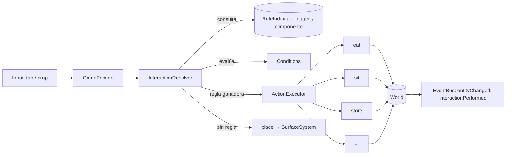

# Interaction System

> **Status:** Accepted (v1) · **Last Updated:** 2026-09-18
> **Related ADR:** [ADR-003](../decisions/ADR-003-ECS.md), [ADR-004](../decisions/ADR-004-DATA-DRIVEN-CONTENT.md)
> **Related Epic:** EPIC-008 (núcleo); EPIC-009, 010, 011, 012, 013, 014, 020 (consumidores)
> **Related HU:** HU-GAME-031, HU-GAME-032, HU-GAME-033
> **Schema:** [INTERACTION_SCHEMA](../data/INTERACTION_SCHEMA.md)

## 1. Objetivo

Que **añadir un objeto nuevo nunca requiera código**, y que el motor **no contenga ningún `if` sobre qué objeto es**.

```ts
// ❌ Prohibido
if (target.prefabId === 'core:bed') sleep(character);
if (item.category === 'food') eat(item);

// ✅ Correcto: capacidades + reglas
// bed tiene componente `bed`; hay una regla  drop(character → has bed) ⇒ sleep
```

## 2. Piezas



| Pieza | Responsabilidad |
|---|---|
| **RuleIndex** | Índice de reglas construido al cargar los packs. Clave `trigger → componente requerido del target`. Evita recorrer todas las reglas. |
| **InteractionResolver** | Dado un trigger y un punto, busca los candidatos y elige **una** regla de forma determinista. |
| **Conditions** | Funciones puras `(ctx) => boolean \| {ok:false, reason}`. Conjunto cerrado. |
| **ActionExecutor** | Ejecuta las acciones de la regla en una transacción del World. |
| **Actions** | Handlers reutilizables, uno por tipo (`eat`, `sit`…). Cada uno delega en su System. |

## 3. Algoritmo de resolución

**Entrada:** `{ trigger, sourceId?, point (world units), sceneId }`

1. **Candidatos de target.** Se hace hit testing en `point` sobre las entidades de la escena activa:
   - Se ordenan de la más cercana al frente a la más lejana (el orden de render invertido).
   - Se excluye el propio `source` y lo que lleva encima (lo que sostiene, lo que viste).
   - La transparencia al input ([INPUT_SYSTEM §5](INPUT_SYSTEM.md), punto 3) vale para `tap` y `longPress`. En un `drop`, **toda** entidad con hitbox es candidata: una caja sin reglas `tap` sigue pudiendo recibir objetos.
   - Si el punto cae sobre un elemento de UI registrado como drop target (la mochila), ese elemento es el **primer** candidato. Además **tapa** lo que hay debajo: con `uiTarget`, solo las reglas de ese target son candidatas (HU-GAME-037 R3).
2. **Por cada candidato**, se calcula la **zona** tocada: entre las `hitbox.zones` que contienen el punto, gana la de **menor área** (la más específica: `mouth` gana a `head`, y `handL` gana a `body`). Si empatan en área, la de nombre alfabéticamente menor. Si ninguna contiene el punto, la zona es `body`. **El orden de las claves del JSON no importa.**
3. **Reglas aplicables.** Del RuleIndex se toman las reglas con el `trigger` dado. Cada regla pasa si cumple todo esto:
   - `source` coincide con el source;
   - `target` coincide con el candidato, **incluida la zona**;
   - no está en `interactions.disabledRules` de ninguno de los dos prefabs.

   Las `extraRules` locales de ambos prefabs se añaden a la lista.
4. **Orden de preferencia** (determinista):
   1. `priority` mayor.
   2. Candidato más cercano al frente.
   3. Mayor especificidad: número de restricciones del matcher (`has`, `tags`, `zone`, `state`…).
   4. `id` de la regla en orden alfabético (desempate estable).
5. **Condiciones.** Se evalúan en orden sobre la regla ganadora:
   - **Si pasan:** se ejecutan sus acciones.
   - **Si fallan:** se prueba la **siguiente** regla del orden. Así, "guardar en nevera" falla si está cerrada y cae a "apoyar sobre la nevera".
   - **Si ninguna pasa:** se emite `interactionRejected` con la razón de la primera regla que coincidió (sirve para el feedback) y se ejecuta el fallback **de esa regla** (`fallback`: `place` por defecto, o `returnToOrigin` para los productos de tienda, ver [GAME_RULES §4](../product/GAME_RULES.md)).
6. **Fallback** (solo con trigger `drop`): la acción `place`. El SurfaceSystem busca la superficie de apoyo bajo el punto (ver [INPUT_SYSTEM](INPUT_SYSTEM.md)).
7. **Tap sin regla:** no hace nada, salvo la animación `tap` si el objeto la define.

**Complejidad esperada:** unos pocos candidatos (≤ 5) × reglas indexadas (≤ 10) por evento. Es despreciable.

## 4. Resolución de los casos pedidos

| Caso | Cómo se resuelve | Regla | Resultado |
|---|---|---|---|
| **personaje + comida** | Se arrastra la manzana (source `edible`) sobre la cara (target `character`, zona `mouth`/`head`) | `eat_food` (100) | Pose `eat`, `bitesLeft−1`, sprite del mordisco. Si el punto cae en la **mano** → `hold_item` (50): la sostiene. |
| **personaje + silla** | Se arrastra el personaje (source `character`) sobre la silla (`seat`) | `sit_on_seat` (80) + `seatFree` | Anclado en `seat.anchor`, pose `sit`. Si está ocupada → siguiente regla o `place` junto a la silla. |
| **personaje + cama** | Se arrastra el personaje sobre la cama (`bed`) | `sleep_on_bed` (85) | Pose `sleep`, expresión con ojos cerrados. La cama también tiene `surface`: si el que se suelta es un objeto (no un personaje), se apoya encima. |
| **objeto + contenedor** | Se arrastra un objeto sobre la zona `inside` de la nevera | `store_in_container` (70) + `isOpen` + `containerHasSpace` | Location → `container`. Si la nevera está **cerrada**, la condición falla y el objeto se apoya encima (`place`). Si está llena → `rejectHint` y `place`. |
| **ropa + personaje** | Se arrastra una camiseta (`wearable`) sobre el cuerpo del personaje | `wear_clothes` (90) + `canWear` | La prenda pasa a `worn`. La anterior del mismo slot cae junto al personaje (ver [CHARACTER_SYSTEM](CHARACTER_SYSTEM.md)). |
| **puerta + personaje** | Se arrastra el personaje sobre la puerta (`portal`) | `travel_portal` (95) | Transición a `targetSceneId` y aparición en `targetSpawnId`. Lo que sostiene viaja con él. **Tap en la puerta** → `tap_open` si además es `openable` (efecto visual). |
| comida + mochila | Se arrastra sobre el botón de la mochila | `store_in_backpack` | Location → `inventory` |
| producto + caja registradora | Producto sin comprar sobre la entidad `checkout` | `buy_at_register` | Descuenta monedas y marca `purchased=true` |

## 5. Arrastrar algo que está "dentro de algo"

El DragSystem aplica estas reglas al **empezar** el arrastre, antes de cualquier regla de interacción. Son transiciones de la location:

| Estado previo | Al empezar el drag |
|---|---|
| Personaje sentado o dormido | Se ejecuta `standUp` implícito y el personaje pasa a pose `dangle` |
| Objeto sostenido (`held`) | Sale de la mano (location → escena, en la posición del dedo) |
| Objeto en un contenedor abierto | `takeOut` implícito. Si el contenedor está cerrado, sus objetos no son tocables. |
| Prenda vestida | **No** se arrastra directamente en el MVP. Se quita con el gesto de HU-GAME-040. |
| Objeto sin comprar en la tienda | Se arrastra dentro de la tienda. Al intentar salir por el portal → `interactionRejected(notPurchased)` y el objeto vuelve al estante. |

## 6. Feedback (HU-GAME-033)

Durante el arrastre, el Input adapter pide al resolver una **previsualización** cada vez que el target bajo el dedo cambia. Nunca en cada frame.

- **Pasan las condiciones** → se resalta el target (outline suave y ligera escala). Ver [ANIMATION_GUIDELINES](../design/ANIMATION_GUIDELINES.md).
- **Coincide la regla pero falla una condición** → se muestra `rejectHint` si existe.
- **Previsualizar no ejecuta acciones.** Es una función pura: `resolver.preview(ctx) → { ruleId, ok, reason }`.

## 7. Extender el sistema

| Quiero… | Hago… | ¿Toca el motor? |
|---|---|---|
| Un objeto nuevo que se come | Prefab con `edible` | No |
| Un contenedor nuevo (caja de juguetes) | Prefab con `states` + `openable` + `container` | No |
| Que un objeto concreto no se pueda guardar en la mochila | `interactions.disabledRules: ["core:store_in_backpack"]` | No |
| Una interacción nueva entre capacidades existentes (p. ej. regar una planta con una regadera: `setState` en la planta) | Regla nueva en `*.rules.json` usando acciones existentes | No |
| Un comportamiento nuevo (p. ej. **combinar** objetos) | Acción nueva + componente nuevo + ADR si cambia el modelo | **Sí**. Justificarlo en la HU. |

## 8. Pruebas mínimas (EPIC-024)

- Tests unitarios del resolver con un `RuleIndex` de fixtures: prioridad, desempates, zonas, condiciones y fallback.
- Un test por acción (`validate` + `execute`) en el harness headless.
- Tests de escenario, que reproducen cada fila del §4 de principio a fin sobre un World en memoria.
