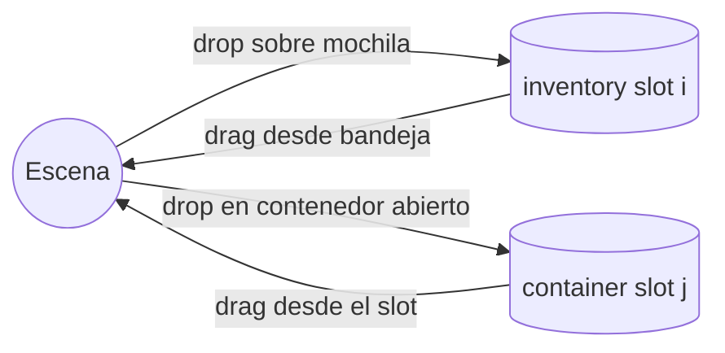

# Inventory & Containers

> **Status:** Accepted (v1) · **Last Updated:** 2026-09-18
> **Related ADR:** [ADR-003](../decisions/ADR-003-ECS.md)
> **Related Epic:** EPIC-009, EPIC-010, EPIC-011 (armario)
> **Related HU:** HU-GAME-034 a HU-GAME-038, HU-GAME-041

Tanto los contenedores como la mochila son **locations** (ver [ECS §4](ECS.md)). No existe una "lista de items" separada que haya que sincronizar.

## 1. Contenedores (muebles)

**Componentes:** `container` + normalmente `states` + `openable`.

| Operación | Disparador | Reglas |
|---|---|---|
| Abrir / cerrar | Tap sobre el mueble (`tap_open`) | Cambia `states.current`. El sprite cambia vía `sprite.byState`. |
| Guardar | Soltar un objeto en la zona `inside` de un contenedor **abierto** (`store_in_container`) | `accepts`/`rejects` por tags y slot libre. El objeto va al **primer slot libre**. |
| Sacar | Arrastrar un objeto visible de un contenedor abierto | `takeOut` implícito al empezar el drag (ver [INTERACTION_SYSTEM §5](INTERACTION_SYSTEM.md)) |
| Ver el contenido | Contenedor abierto | Los objetos se dibujan en `container.slots[i]` (relativos al pivot del contenedor), en la capa `furnitureBack`+1 si el interior se ve |

**Decisiones:**
- **Cerrado = no tocable por dentro.** Los objetos de un contenedor cerrado no se renderizan ni se pueden tocar.
- **Sin UI de rejilla:** el interior se ve *en el mundo* (estilo casa de muñecas), no en un popup.
- **Contenedores anidados:** una caja dentro de una nevera está **prohibida** en el MVP. El motor rechaza siempre las entidades con componente `container` (regla fija, además de `rejects` por tags), lo que evita ciclos. [NOT NEEDED YET]
- **Mover un contenedor con cosas dentro** (HU-GAME-048): el contenido viaja con él automáticamente, porque su location es relativa al contenedor.

## 2. Mochila (inventario global)

- **Qué es:** un botón del HUD que funciona como **drop target** y abre una **bandeja de slots**. Sirve para llevar objetos entre escenas sin tener que sostenerlos.
- **Capacidad MVP: 12 slots** (`player.inventory.capacity`).
- **Guardar:** arrastrar un objeto sobre el botón de la mochila → regla `store_in_backpack`, si hay espacio, el objeto no es un mueble ni un personaje, y no es un producto sin comprar. Tampoco acepta entidades con componente `container` (misma regla fija contra el anidamiento que los contenedores).
- **Sacar:** abrir la bandeja y arrastrar un slot hacia la escena. El comando `takeFromInventory` crea el drag del objeto desde el punto del dedo.
- **Es global:** el contenido no depende de la escena. Se carga al inicio junto con las entidades globales.

## 3. Armario (HU-GAME-041)

- Es un contenedor más, con `accepts: ["clothing"]`, que empieza con las prendas iniciales del pack.
- **No hay un sistema de armario especial:** las prendas se sacan arrastrándolas y se visten soltándolas sobre el personaje.

## 4. Casos límite (comunes)

| Caso | Resultado |
|---|---|
| Contenedor lleno | `interactionRejected(containerFull)`: el contenedor hace shake, suena el sonido "nop" y el objeto se apoya encima o al lado |
| Tag no aceptado (un zapato en la nevera) | `interactionRejected(notAccepted)` y `place` |
| Mochila llena | Feedback en el botón de la mochila y `place` bajo el punto |
| Cerrar un contenedor mientras se arrastra algo hacia él | El drop se evalúa contra el estado **en el momento del drop** |
| Guardar un objeto sostenido | Sale de la mano y entra al contenedor, en una sola transacción |
| Comida parcialmente comida | Se guarda con su `bitesLeft` |
