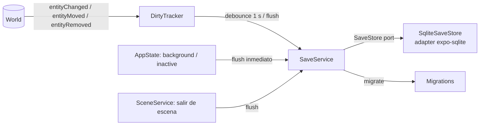

# Save System

> **Status:** Accepted (v1) · **Last Updated:** 2026-09-18
> **Related ADR:** [ADR-005](../decisions/ADR-005-OFFLINE-FIRST.md), [ADR-006](../decisions/ADR-006-SQLITE.md)
> **Related Epic:** EPIC-015
> **Related HU:** HU-GAME-052, HU-GAME-053, HU-GAME-054, HU-GAME-055, HU-GAME-072
> **Schema:** [SAVE_SCHEMA](../data/SAVE_SCHEMA.md)

## 1. Requisitos

- **Qué se persiste:** personajes, apariencia, escena actual, posiciones y estados de las entidades, contenedores, mochila, desbloqueos, monedas y ajustes.
- **Sin botón de guardar:** el jugador (un niño) nunca debe perder lo que hizo.
- **Ejemplo que debe cumplirse:** "Si dejo un juguete sobre una cama, debe permanecer allí cuando vuelva."

## 2. Componentes

| Pieza | Capa | Responsabilidad |
|---|---|---|
| `DirtyTracker` | core | Conjunto de `EntityId` sucios y flag `playerDirty`. Se suscribe al EventBus. |
| `SaveService` | core | Serializa: de las entidades sucias saca `SavedEntity`, aplicando el filtro de persistibles de SAVE_SCHEMA §2. También carga y migra. |
| `SaveStore` (puerto) | core (interface) | `loadSlot`, `loadEntities(sceneId?)`, `writeBatch({upserts, removals, player})`, `backup()`, `restoreBackup()` |
| `SqliteSaveStore` | adapter | Implementación con `expo-sqlite` (API async y transacciones) |
| `InMemorySaveStore` | test | La misma interfaz para el harness headless |

## 3. Cuándo se guarda

| Disparador | Acción |
|---|---|
| Cualquier cambio de estado persistible | Marca la entidad como sucia y programa un **flush con debounce de 1000 ms** (se reinicia con cada cambio, con un **máximo de 5 s** de espera) |
| `AppState` cambia a `background`/`inactive` | **Flush inmediato** (síncrono en lo posible; la escritura es corta) |
| Cambio de escena | Flush antes de descargar la escena |
| Compra o gasto de monedas | Flush inmediato (economía) |
| Durante un drag | **No** se guarda. Los cambios de `dragStart` (levantarse, sacar de un contenedor) quedan sucios y se guardan tras el `dragEnd` o el `dragCancel`. |

**Presupuesto:** un flush típico, de 1 a 10 entidades, debe tardar menos de 20 ms en un dispositivo de gama baja. Ver [PERFORMANCE](PERFORMANCE.md).

## 4. Carga al iniciar (HU-GAME-053)

1. Abrir la DB y ejecutar las migraciones SQL pendientes (`PRAGMA user_version`).
2. Leer `save_slot 'main'`. Si no existe → **partida nueva**: la pantalla de inicio ofrece crear un personaje.
3. Comprobar `save_version`:
   - si es igual a la actual → continuar;
   - si es menor → backup y cadena de migraciones;
   - si es mayor → modo "no compatible" (ver SAVE_SCHEMA §5).
4. Aplicar `idAliases`/`removedIds` de los packs cuyas versiones cambiaron.
5. Cargar las entidades globales (personajes, prendas vestidas, mochila, objetos sostenidos).
6. Cargar `player.currentSceneId` usando el diff (SAVE_SCHEMA §4).
7. Colocar la cámara en `player.cameraX`.

**Objetivo:** desde que se toca "Jugar" hasta tener la escena interactiva, **menos de 1,5 s** (ver [PERFORMANCE](PERFORMANCE.md)).

## 5. Integridad

- Cada flush se ejecuta en **una transacción** (`withExclusiveTransactionAsync` o equivalente).
- Invariante que se comprueba en modo desarrollo después de cargar: **cada entidad tiene una location válida**. No hay dos entidades en el mismo slot de contenedor o de mochila, ni dos en la misma mano.
- Si el invariante falla **en producción**, se repara:
  - se mueve la entidad conflictiva a la escena actual, en el spawn `default`;
  - se registra una advertencia.
- **Nunca** se debe bloquear al niño con un error.

## 6. Reiniciar el mundo (HU-GAME-055)

- Solo detrás de la [puerta parental](../stories/mvp/EPIC-026-app-shell.md).
- Primero backup, luego se borra `entity_state` y `entity_removed` del slot y se reinicia `player` (se conservan los `settings`).
- Se pueden **conservar los personajes**. Es una opción en la confirmación.

## 7. Lo que NO se hace ahora

- [DESIGNED FOR LATER] **Varios slots** o perfiles familiares: el esquema ya tiene `slot_id`.
- [DESIGNED FOR LATER] **Exportar/importar `GameSave`** como JSON, para soporte y para la migración a la nube.
- [NOT NEEDED YET] **Cloud save**: ver [BACKEND_FUTURE](BACKEND_FUTURE.md).
- [NOT NEEDED YET] **Cifrado local**: no se guardan datos personales sensibles. Reevaluar si se añaden cuentas.
