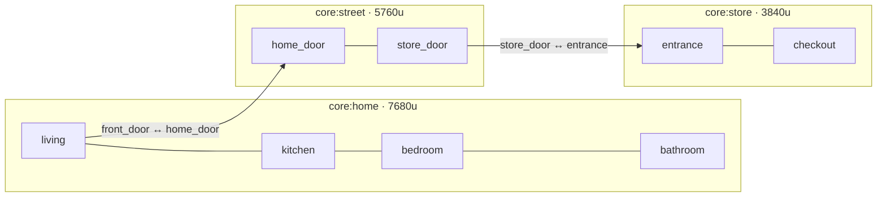

# Scene System

> **Status:** Accepted (v1) · **Last Updated:** 2026-09-18
> **Related ADR:** [ADR-004](../decisions/ADR-004-DATA-DRIVEN-CONTENT.md), [ADR-007](../decisions/ADR-007-VIRTUAL-COORDINATES.md)
> **Related Epic:** EPIC-003, EPIC-014
> **Related HU:** HU-GAME-010, HU-GAME-011, HU-GAME-012, HU-GAME-049, HU-GAME-050, HU-GAME-051
> **Schema:** [SCENE_SCHEMA](../data/SCENE_SCHEMA.md)

## 1. Conceptos

| Concepto | Qué es | Ejemplo MVP |
|---|---|---|
| **Location** (de mapa) | Agrupación visible en el mapa | Home, Street, Store |
| **Scene** | Espacio jugable con su propio JSON y su propia cámara | `core:home`, `core:street`, `core:store` |
| **Zone** | Rango horizontal dentro de una escena, con nombre, música y punto de cámara | salón, cocina, dormitorio, baño |
| **Portal** | Entidad con `portal` que lleva a otra escena | puerta de casa ↔ calle, puerta de la tienda ↔ calle |
| **Spawn point** | Punto de aparición | `default`, `front_door`, `home_door` |

> "Location" de mapa ≠ `Location` de entidad (ECS §4). En el código, la de mapa se llama `MapLocation`.

## 2. SceneService

| Operación | Descripción |
|---|---|
| `enter(sceneId, spawnId, travelers[])` | Carga y entra en una escena. Los `travelers` son los personajes que llegan, con lo que sostienen. |
| `current()` | La escena activa |
| `zoneAt(x)` | Zona de una x (para audio y UI) |

### Carga de escena (`enter`)

1. `sceneWillChange` → SaveService.flush() → AudioService fade out.
2. **Descargar la escena anterior:** se sacan del World sus entidades de escena. Las globales (personajes que viajan, mochila) se quedan.
3. **Construir la nueva** a partir de la definición + el diff guardado (ver [SAVE_SCHEMA §4](../data/SAVE_SCHEMA.md)).
4. **Colocar a los viajeros** en `spawnId`. Si hay varios, se separan 120 unidades en x.
5. Precargar las texturas visibles (ver [RENDERING §6](RENDERING.md)).
6. Colocar la cámara:
   - si es la escena guardada → `player.cameraX`;
   - si no → centrada en el spawn.
7. `sceneLoaded` → música o ambiente de la zona → fade in.

### Personajes entre escenas

- Los personajes **viven en una escena**: su location es `scene` con su `sceneId`. Aun así, están **siempre cargados en memoria** como entidades globales (ver [GAME_ENGINE §3](GAME_ENGINE.md)), y se renderizan solo los de la escena activa.
- Al viajar, su `sceneId` cambia.
- Los personajes que quedaron en otra escena **siguen allí** (persistencia): si dejas a alguien en la tienda, estará en la tienda cuando vuelvas.

## 3. Zonas (HU-GAME-012)

- `zoneAt(cameraCenterX)` determina la **zona activa**, que se usa para la música o el ambiente y para el nombre en la UI (si lo hay).
- Las zonas **no bloquean** el movimiento: los objetos cruzan de la cocina al salón sin cambiar de escena.
- El mapa (HU-GAME-051) muestra los botones de cada zona de la casa. Al tocarlos, la cámara salta a `snapCameraX`.

## 4. Transiciones (HU-GAME-050)

- **Visual:** fundido a un color de la paleta (300 ms), carga y fundido de entrada (300 ms). Si la carga supera 600 ms, aparece un indicador lúdico (una animación, sin texto).
- **Durante la transición se bloquea la entrada.**
- Presupuesto: ver [PERFORMANCE](PERFORMANCE.md#presupuestos).

## 5. Qué NO hace el sistema de escenas

- **No** tiene lógica específica de ninguna escena (nada de `if sceneId === 'store'`). La tienda es tienda por sus entidades (`purchasable`, `checkout`), no por su ID.
- **No** hay pathfinding ni caminar automático. Los personajes se mueven arrastrándolos. [NOT NEEDED YET]
- **No** hay streaming de escenas contiguas. Cada escena se carga completa, con culling del render. [DESIGNED FOR LATER] si una escena supera el presupuesto de entidades.
