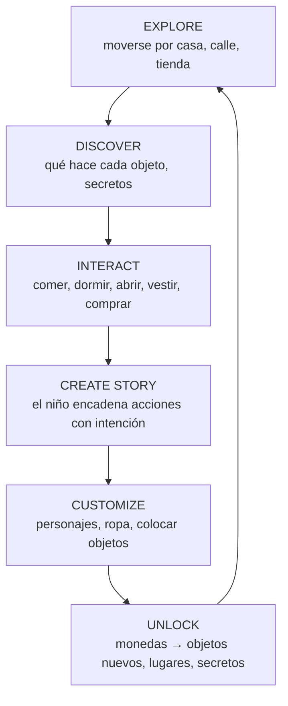
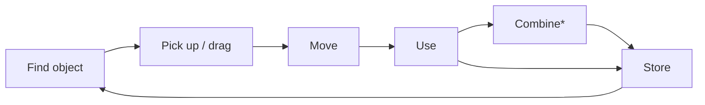
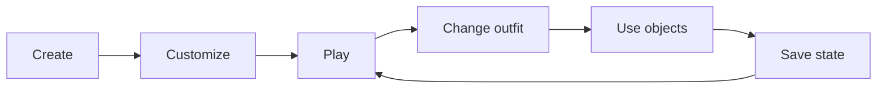
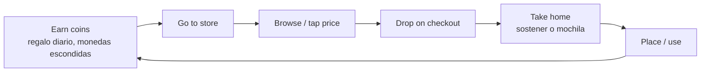
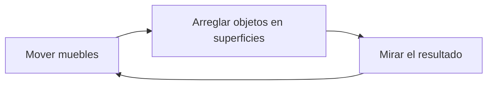

# Core Game Loop

> **Status:** Accepted (v1) · **Last Updated:** 2026-09-18
> **Related:** [GAME_VISION](GAME_VISION.md) · [GAME_DESIGN_DOCUMENT](GAME_DESIGN_DOCUMENT.md) · [GAME_RULES](GAME_RULES.md)

## 1. Macro loop

| Etapa | En el MVP | Qué lo alimenta |
|---|---|---|
| **EXPLORE** | Paneo horizontal, 4 habitaciones, calle, tienda, mapa | Escenas anchas, zonas, portales |
| **DISCOVER** | Tocar cosas: cajones, lámparas, frutero que da manzanas, monedas escondidas (P2) | Componentes `openable`, `switchable`, `spawner`, `collectible` |
| **INTERACT** | Arrastrar y soltar sobre personajes, muebles y contenedores | Reglas de interacción |
| **CREATE STORY** | Emergente: "la familia desayuna y se va a la tienda" | Libertad total + persistencia |
| **CUSTOMIZE** | Creador de personajes, ropa, reorganizar la casa | EPIC-005, 011, 013 |
| **UNLOCK** | Comprar objetos con monedas (regalo diario, monedas escondidas) | EPIC-020 |

> **UNLOCK no es un muro.** En el MVP **todo lugar está accesible desde el inicio**. Desbloquear significa conseguir **más objetos**, nunca acceso al juego básico.

## 2. Micro loops

### OBJECT LOOP

- **Find:** verlo en la escena, abrir un contenedor o tocar un dispensador.
- **Pick up / drag:** arrastrar o dar a una mano (`hold`).
- **Move:** llevarlo a otra habitación (auto-scroll), a otra escena (sostenido o en la mochila).
- **Use:** comer, beber, vestir, encender, sentarse o dormir (depende de sus componentes).
- **Combine*:** [POST-MVP] EPIC-030.
- **Store:** en un contenedor o en la mochila. **Persiste.**

### CHARACTER LOOP

- **Create / Customize:** creador (cuerpo, piel, cara, pelo, ropa inicial).
- **Play:** colocarlo en el mundo, arrastrarlo, sentarlo, acostarlo.
- **Change outfit:** soltar ropa encima, quitar prendas, usar el armario.
- **Use objects:** comer, beber, sostener cosas.
- **Save state:** automático. Pose, ropa y ubicación persisten.

### SHOPPING LOOP (Fase 2)

### DECORATE LOOP (MVP básico)

Decorar paredes y suelos es [POST-MVP] (EPIC-034).

## 3. Ritmo de una sesión típica (5–20 min)

1. **0:00:** Title → "Continuar" (1 tap). Aparece la casa **tal como se dejó**.
2. **0:30:** El niño retoma una historia: los personajes siguen dormidos, los despierta arrastrándolos.
3. **2:00:** Cocina: abre la nevera, les da de comer y bebe jugo. El vaso queda vacío en la mesa.
4. **5:00:** Cambio de ropa en el dormitorio con el armario.
5. **8:00:** Sale a la calle, recoge una moneda escondida y va a la tienda. Compra un juguete.
6. **12:00:** Vuelve a casa y coloca el juguete en la cama.
7. **Cierra la app en cualquier momento.** El siguiente día todo sigue ahí.

## 4. Motivaciones que sostienen el loop

| Motivación | Cómo se atiende |
|---|---|
| Control y autoría | Libertad total y persistencia |
| Curiosidad | Cada objeto hace "algo" y hay sorpresas |
| Expresión | Personajes y casa personalizados |
| Colección suave | Comprar objetos nuevos (sin rareza ni presión) |
| Rutina reconfortante | Mundo estable y predecible que "espera" al niño |
