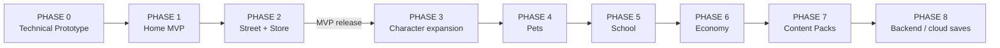

# Roadmap

> **Status:** Accepted (v1). **Sin fechas**, a propósito. · **Last Updated:** 2026-09-18
> **Related:** [MVP_SCOPE](MVP_SCOPE.md) · [../stories/BACKLOG.md](../stories/BACKLOG.md) · [../stories/EPICS.md](../stories/EPICS.md)

El **MVP** son las fases 0, 1 y 2. Las fases 3 a 8 se replanifican según lo que se aprenda del MVP. Su orden puede cambiar, excepto la 7, que depende de la infraestructura de packs descargables.

---

## PHASE 0: Technical Prototype

- **Objetivo:** validar la arquitectura con una sola habitación y placeholders. El drag tiene que ir fluido en Android de gama baja, el modelo de datos tiene que funcionar y el guardado tiene que persistir posiciones y estados.
- **HU relacionadas:** 001, 002, 003, 004, 005, 006, 007, 010, 011, 024, 025, 026, 027, 028, 031, 032, 052, 053, 054, 068, 069.
- **Dependencias:** ninguna. Assets placeholder CC0 (Kenney/Glitch, ver [FREE_ASSETS](../design/research/FREE_ASSETS.md)).
- **Resultado esperado:**
  - App en landscape con una escena JSON (una habitación) y 10 objetos placeholder que se arrastran, se apoyan en superficies y persisten tras cerrar la app.
  - Una regla `tap` (abrir y cerrar) y una `drop` de prueba (por ejemplo, guardar en un contenedor sencillo).
  - Tests headless verdes. Validador de contenido en la CI.
- **Spikes obligatorios** (los resultados se anotan en los ADR correspondientes):
  1. Latencia del hit test en JS frente al UI thread (ADR-009).
  2. Rendimiento del render Skia con unas 120 entidades (ADR-002).
  3. Calidad del tinte de piel con arte de prueba (CHARACTER_SYSTEM §4). Se puede adelantar a la Fase 1.
- **Criterio de salida:** los presupuestos "target" de [PERFORMANCE](../architecture/PERFORMANCE.md) se cumplen en el Android de referencia para el drag y el paneo.

## PHASE 1: Home MVP

- **Objetivo:** la casa completa y jugable con personajes creados por el jugador.
- **HU relacionadas:** 008, 009, 012, 013–023, 029, 030, 033, 034–048, 055, 056–058, 059–062, 070, 071, 072, 073–075.
- **Dependencias:**
  - Fase 0 completa.
  - **Guía de arte aprobada** ([ART_DIRECTION](../design/ART_DIRECTION.md)).
  - Arte de personajes y de la casa: al menos el primer lote de producción. El resto puede seguir en placeholder mientras se desarrolla.
- **Resultado esperado:** crear personajes, jugar en las 4 habitaciones con los 38 prefabs de la casa y las 15 prendas, audio, mochila, ajustes y puerta parental. Todo persiste.
- **Criterio de salida:** prueba con 3 o más niños en el hogar (juegan 10 minutos sin ayuda para leer).

## PHASE 2: Street + Store

- **Objetivo:** salir de casa, con navegación entre escenas, economía y tienda. **Con esto el MVP queda completo.**
- **HU relacionadas:** 049, 050, 051, 063, 064, 065, 066, 067.
- **Dependencias:** Fase 1 y arte de la calle y de la tienda.
- **Resultado esperado:**
  - Portales casa ↔ calle ↔ tienda.
  - Personajes que viajan con lo que sostienen.
  - Monedas (iniciales y diarias).
  - Compra en la caja registradora.
  - Mapa de ubicaciones.
- **Criterio de salida (MVP release):** [MVP_SCOPE §4](MVP_SCOPE.md).

---

## PHASE 3: Character expansion (+ diferenciadores ligeros)

- **Objetivo:** más expresión, y los primeros diferenciadores propios.
- **HU relacionadas:**
  - 100 (aleatorizar personaje), 108 (accesorios), 107 y 116 (decoración);
  - 102 (combinar objetos), 103 (álbum de recuerdos), 111 (secretos);
  - 105 y 106 (NPCs), 110 (accesibilidad avanzada);
  - candidatas: 101, 109, 118, 119, 120, 121, 122.
- **Dependencias:** MVP publicado y feedback. EPIC-029 y EPIC-030 requieren ADRs nuevos (acciones `combine` y `emit`).
- **Resultado esperado:** personajes más ricos, primeras recetas, álbum de recuerdos y la tienda con tendero.

## PHASE 4: Pets

- **Objetivo:** mascotas simples con personalidad.
- **HU relacionadas:** 104 (se añadirán más HU al planificar la fase).
- **Dependencias:** componente `pet` + PetSystem (ADR nuevo). Posiblemente movimiento autónomo simple, que hoy está [NOT NEEDED YET].
- **Resultado esperado:** adoptar, alimentar y acostar a una mascota que sigue a su dueño.

## PHASE 5: School

- **Objetivo:** el **primer Content Pack** fuera de `core`, empaquetado todavía en el binario, para validar las extensiones de escena y la independencia del motor.
- **HU relacionadas:** 113.
- **Dependencias:** extensiones de escena ([CONTENT_PACK_SCHEMA §7](../data/CONTENT_PACK_SCHEMA.md)).
- **Resultado esperado:** la escuela (aula y patio), a la que se llega desde la calle, **sin cambios en `engine/`**. Esto es el **test de la arquitectura data-driven**.

## PHASE 6: Economy

- **Objetivo:** economía creativa.
- **HU relacionadas:** 112 (negocios del jugador), ampliaciones de 067.
- **Dependencias:** NPCs (Fase 3) para que haya "clientes".
- **Resultado esperado:** el niño monta un puesto y los NPCs compran.

## PHASE 7: Content Packs

- **Objetivo:** packs descargables y su monetización.
- **HU relacionadas:** 114, 115 (IAP con puerta parental), 117 (analytics con privacidad).
- **Dependencias:** decisión de monetización (OQ-03), infraestructura de distribución (CDN) y verificación de integridad.
- **Resultado esperado:** comprar y descargar el pack Beach o el pack Hospital sin actualizar la app.

## PHASE 8: Backend / cloud saves

- **Objetivo:** guardado en la nube y multi-dispositivo familiar.
- **HU relacionadas:** 201, 202.
- **Dependencias:** [BACKEND_FUTURE](../architecture/BACKEND_FUTURE.md), revisión legal de privacidad infantil y cuentas de adulto.
- **Resultado esperado:** la partida se sincroniza entre la tablet y el móvil del mismo hogar.
