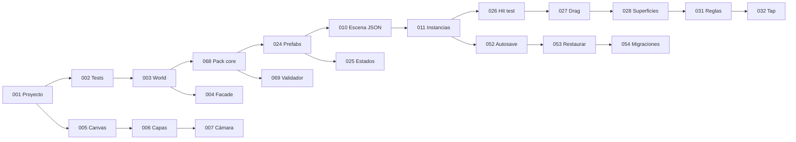

# Backlog

> **Status:** Living document · **Last Updated:** 2026-09-18
> **Fuente de IDs:** [EPICS.md](EPICS.md) · **Detalle MVP:** [mvp/](mvp/) · **POST-MVP / FUTURE:** [POST_MVP_STORIES.md](POST_MVP_STORIES.md)
> **Estados:** `Draft` → `Ready` (cumple [DoR](DEFINITION_OF_READY.md)) → `In Progress` → `Done` (cumple [DoD](DEFINITION_OF_DONE.md)) · `Dropped`

Sin fechas. El orden dentro de cada prioridad sigue las dependencias. Hay que actualizar el **Estado** al trabajar una HU.

## Resumen

| Clasificación | Nº HU |
|---|---|
| MVP · P0 | 45 |
| MVP · P1 | 27 |
| MVP · P2 | 3 |
| **MVP total** | **75** |
| POST-MVP | 23 (HU-GAME-100..122) |
| FUTURE | 7 (HU-GAME-200..206) |

## Orden de implementación sugerido (camino crítico de la Fase 0)

## MVP · P0

| ID | Título | Epic | MoSCoW | Fase | Depende de | Estado |
|---|---|---|---|---|---|---|
| [HU-GAME-001](mvp/EPIC-001-foundation.md) | Configurar el proyecto Expo para el juego | EPIC-001 | Must | 0 | — | In Progress (falta verificación manual en dispositivo) |
| [HU-GAME-002](mvp/EPIC-001-foundation.md) | Configurar pruebas unitarias y harness headless | EPIC-001 | Must | 0 | HU-GAME-001 | Done |
| [HU-GAME-003](mvp/EPIC-001-foundation.md) | Núcleo del World: entidades, componentes y eventos | EPIC-001 | Must | 0 | HU-GAME-001, HU-GAME-002 | Done |
| [HU-GAME-004](mvp/EPIC-001-foundation.md) | GameFacade: puente UI ↔ motor | EPIC-001 | Must | 0 | HU-GAME-003 | Done |
| [HU-GAME-005](mvp/EPIC-002-rendering.md) | Canvas Skia con resolución virtual | EPIC-002 | Must | 0 | HU-GAME-001 | In Progress (falta verificación manual en dispositivo) |
| [HU-GAME-006](mvp/EPIC-002-rendering.md) | Renderizar entidades por capas y orden z | EPIC-002 | Must | 0 | HU-GAME-003, HU-GAME-005 | In Progress (falta verificación manual) |
| [HU-GAME-007](mvp/EPIC-002-rendering.md) | Cámara horizontal con paneo | EPIC-002 | Must | 0 | HU-GAME-005 | In Progress (falta verificación manual) |
| [HU-GAME-010](mvp/EPIC-003-scenes.md) | Cargar una escena declarada en JSON | EPIC-003 | Must | 0 | HU-GAME-003, HU-GAME-068 | Done (verificación manual en dispositivo pendiente) |
| [HU-GAME-011](mvp/EPIC-003-scenes.md) | Instanciar entidades desde prefabs con overrides | EPIC-003 | Must | 0 | HU-GAME-010, HU-GAME-024 | Done |
| [HU-GAME-024](mvp/EPIC-006-objects.md) | Registro de prefabs de objetos con validación | EPIC-006 | Must | 0 | HU-GAME-003, HU-GAME-068 | Done |
| [HU-GAME-025](mvp/EPIC-006-objects.md) | Estados de objetos y sprites por estado | EPIC-006 | Must | 0 | HU-GAME-024, HU-GAME-006 | Done (toggleOpen/toggleSwitch llegan con 034/047) |
| [HU-GAME-026](mvp/EPIC-006-objects.md) | Hitbox y hit testing | EPIC-006 | Must | 0 | HU-GAME-024, HU-GAME-007 | Done |
| [HU-GAME-027](mvp/EPIC-007-drag-drop.md) | Arrastrar objetos | EPIC-007 | Must | 0 | HU-GAME-026 | In Progress (falta verificación manual del gesto y sombra del DragProxy) |
| [HU-GAME-028](mvp/EPIC-007-drag-drop.md) | Soltar objetos sobre superficies y el suelo | EPIC-007 | Must | 0 | HU-GAME-027 | Done |
| [HU-GAME-031](mvp/EPIC-008-interaction.md) | Resolver interacciones mediante reglas de datos | EPIC-008 | Must | 0 | HU-GAME-028 | Done (fallback returnToOrigin llega con 064/066) |
| [HU-GAME-032](mvp/EPIC-008-interaction.md) | Interacciones por tap | EPIC-008 | Must | 0 | HU-GAME-026, HU-GAME-031 | Done |
| [HU-GAME-052](mvp/EPIC-015-save.md) | Autoguardado del mundo en SQLite | EPIC-015 | Must | 0 | HU-GAME-003, HU-GAME-011 | Done (SQLite verificado solo en dispositivo) |
| [HU-GAME-053](mvp/EPIC-015-save.md) | Restaurar la partida al iniciar | EPIC-015 | Must | 0 | HU-GAME-052 | Done |
| [HU-GAME-054](mvp/EPIC-015-save.md) | Versionado y migraciones de guardado | EPIC-015 | Must | 0 | HU-GAME-052 | Done |
| [HU-GAME-068](mvp/EPIC-021-content.md) | Pack "core" con manifest y namespaces | EPIC-021 | Must | 0 | HU-GAME-003 | Done |
| [HU-GAME-069](mvp/EPIC-024-testing.md) | Validador de contenido para la CLI y la CI | EPIC-024 | Must | 0 | HU-GAME-068, HU-GAME-002 | Done |
| [HU-GAME-013](mvp/EPIC-004-characters.md) | Renderizar un personaje por capas | EPIC-004 | Must | 1 | HU-GAME-006 | Done (tinte y 12 personajes: verificación en dispositivo; ADR-010 Proposed) |
| [HU-GAME-014](mvp/EPIC-004-characters.md) | Poses del personaje | EPIC-004 | Must | 1 | HU-GAME-013 | Done (sprites de pose sit/sleep/eat llegan con su arte; fallback a idle) |
| [HU-GAME-016](mvp/EPIC-004-characters.md) | Sostener objetos en las manos | EPIC-004 | Must | 1 | HU-GAME-014, HU-GAME-031 | Done |
| [HU-GAME-017](mvp/EPIC-004-characters.md) | Arrastrar personajes | EPIC-004 | Must | 1 | HU-GAME-014, HU-GAME-027 | Done (auto-scroll en HU-GAME-029; asientos en EPIC-013) |
| [HU-GAME-018](mvp/EPIC-005-creator.md) | Abrir el creador y elegir cuerpo y tono de piel | EPIC-005 | Must | 1 | HU-GAME-013, HU-GAME-004 | Done (verificación en Android/iOS y tablet pendiente) |
| [HU-GAME-019](mvp/EPIC-005-creator.md) | Elegir ojos y boca | EPIC-005 | Must | 1 | HU-GAME-018 | Done |
| [HU-GAME-020](mvp/EPIC-005-creator.md) | Elegir peinado y color de pelo | EPIC-005 | Must | 1 | HU-GAME-018 | Done (iconos de pelo sin teñir: propuesta R4 pendiente) |
| [HU-GAME-021](mvp/EPIC-005-creator.md) | Elegir ropa inicial | EPIC-005 | Must | 1 | HU-GAME-018 | Done (armario de contenido llega con HU-GAME-041) |
| [HU-GAME-022](mvp/EPIC-005-creator.md) | Guardar, listar y editar personajes | EPIC-005 | Must | 1 | HU-GAME-018, HU-GAME-052 | Done |
| [HU-GAME-023](mvp/EPIC-005-creator.md) | Colocar personajes creados en el mundo | EPIC-005 | Must | 1 | HU-GAME-022, HU-GAME-010 | Done (foco de cámara: verificación en dispositivo) |
| [HU-GAME-034](mvp/EPIC-009-containers.md) | Abrir y cerrar muebles | EPIC-009 | Must | 1 | HU-GAME-025, HU-GAME-032 | Done (sonidos con EPIC-016) |
| [HU-GAME-035](mvp/EPIC-009-containers.md) | Guardar objetos en contenedores | EPIC-009 | Must | 1 | HU-GAME-034, HU-GAME-031 | Done |
| [HU-GAME-036](mvp/EPIC-009-containers.md) | Sacar objetos de contenedores | EPIC-009 | Must | 1 | HU-GAME-035 | Done |
| [HU-GAME-039](mvp/EPIC-011-clothing.md) | Vestir prendas soltándolas sobre el personaje | EPIC-011 | Must | 1 | HU-GAME-013, HU-GAME-031 | Done |
| [HU-GAME-042](mvp/EPIC-012-food.md) | Comer alimentos por mordiscos | EPIC-012 | Must | 1 | HU-GAME-031, HU-GAME-014, HU-GAME-025 | Done (comida real de la casa con EPIC-017) |
| [HU-GAME-043](mvp/EPIC-012-food.md) | Beber bebidas | EPIC-012 | Must | 1 | HU-GAME-042 | Done (bebidas reales con EPIC-017) |
| [HU-GAME-045](mvp/EPIC-013-furniture.md) | Sentarse en asientos | EPIC-013 | Must | 1 | HU-GAME-017, HU-GAME-031 | Done (asientos reales con EPIC-017) |
| [HU-GAME-046](mvp/EPIC-013-furniture.md) | Dormir en camas | EPIC-013 | Must | 1 | HU-GAME-045 | Done (cama y manta reales con EPIC-017) |
| [HU-GAME-059](mvp/EPIC-017-home.md) | Salón jugable | EPIC-017 | Must | 1 | HU-GAME-012, HU-GAME-034, HU-GAME-035, HU-GAME-045, HU-GAME-047 | Done (arte placeholder) |
| [HU-GAME-060](mvp/EPIC-017-home.md) | Cocina jugable | EPIC-017 | Must | 1 | HU-GAME-035, HU-GAME-042, HU-GAME-043, HU-GAME-044, HU-GAME-045, HU-GAME-047 | Done (arte placeholder) |
| [HU-GAME-061](mvp/EPIC-017-home.md) | Dormitorio jugable | EPIC-017 | Must | 1 | HU-GAME-041, HU-GAME-046, HU-GAME-047 | Done (arte placeholder) |
| [HU-GAME-073](mvp/EPIC-026-app-shell.md) | Pantalla de inicio | EPIC-026 | Must | 1 | HU-GAME-004, HU-GAME-053 | Draft |
| [HU-GAME-049](mvp/EPIC-014-navigation.md) | Puertas y portales entre escenas | EPIC-014 | Must | 2 | HU-GAME-010, HU-GAME-031, HU-GAME-017 | Draft |
| [HU-GAME-050](mvp/EPIC-014-navigation.md) | Transición entre escenas | EPIC-014 | Must | 2 | HU-GAME-049 | Draft |

## MVP · P1

| ID | Título | Epic | MoSCoW | Fase | Depende de | Estado |
|---|---|---|---|---|---|---|
| [HU-GAME-008](mvp/EPIC-002-rendering.md) | Culling y carga de fondos por chunks | EPIC-002 | Should | 1 | HU-GAME-006, HU-GAME-007 | In Progress (falta medición de estrés en release) |
| [HU-GAME-009](mvp/EPIC-002-rendering.md) | Tweens y animaciones simples | EPIC-002 | Should | 1 | HU-GAME-006 | In Progress (falta verificación manual de presets) |
| [HU-GAME-012](mvp/EPIC-003-scenes.md) | Zonas (habitaciones) dentro de una escena | EPIC-003 | Should | 1 | HU-GAME-010 | Done (botones de zona llegan con el mapa, HU-GAME-051) |
| [HU-GAME-015](mvp/EPIC-004-characters.md) | Expresiones faciales | EPIC-004 | Should | 1 | HU-GAME-013 | Done |
| [HU-GAME-029](mvp/EPIC-007-drag-drop.md) | Auto-scroll de la cámara al arrastrar cerca del borde | EPIC-007 | Must | 1 | HU-GAME-027, HU-GAME-007 | Done (verificación a 60/120 Hz en dispositivo) |
| [HU-GAME-033](mvp/EPIC-008-interaction.md) | Resaltar el destino válido durante el arrastre | EPIC-008 | Should | 1 | HU-GAME-031 | Done (hint de rechazo visual y resaltado de la mochila llegan con HU-GAME-037) |
| [HU-GAME-037](mvp/EPIC-010-inventory.md) | Guardar objetos en la mochila | EPIC-010 | Should | 1 | HU-GAME-031, HU-GAME-004 | Done (resaltado del botón durante el drag: pendiente) |
| [HU-GAME-038](mvp/EPIC-010-inventory.md) | Sacar objetos de la mochila | EPIC-010 | Should | 1 | HU-GAME-037 | Done (verificación del arrastre desde la bandeja en dispositivo) |
| [HU-GAME-040](mvp/EPIC-011-clothing.md) | Quitar prendas del personaje | EPIC-011 | Should | 1 | HU-GAME-039 | Done (gesto a verificar en dispositivo) |
| [HU-GAME-041](mvp/EPIC-011-clothing.md) | Armario con ropa disponible | EPIC-011 | Should | 1 | HU-GAME-035, HU-GAME-039 | Done (armario con 8 prendas en el dormitorio) |
| [HU-GAME-044](mvp/EPIC-012-food.md) | Dispensadores de objetos | EPIC-012 | Should | 1 | HU-GAME-032, HU-GAME-024 | Done (frutero con EPIC-017) |
| [HU-GAME-047](mvp/EPIC-013-furniture.md) | Objetos encendibles (lámpara, TV, grifo) | EPIC-013 | Should | 1 | HU-GAME-032, HU-GAME-025 | Done (sonido toggle con EPIC-016) |
| [HU-GAME-048](mvp/EPIC-013-furniture.md) | Mover muebles | EPIC-013 | Should | 1 | HU-GAME-027, HU-GAME-028 | Done (propuesta R6, dibujar al ocupante con el proxy: pendiente) |
| [HU-GAME-056](mvp/EPIC-016-audio.md) | Sonidos de interacción | EPIC-016 | Should | 1 | HU-GAME-031 | Done (efectos placeholder CC0; verificación de polifonía en dispositivo) |
| [HU-GAME-057](mvp/EPIC-016-audio.md) | Música y ambiente por ubicación | EPIC-016 | Should | 1 | HU-GAME-012 | In Progress (motor y adaptador listos; faltan pistas de música/ambiente CC0) |
| [HU-GAME-058](mvp/EPIC-016-audio.md) | Control de volumen y silencio | EPIC-016 | Must | 1 | HU-GAME-056, HU-GAME-075 | In Progress (setSetting y persistencia listos; controles en la pantalla de Ajustes, HU-GAME-075) |
| [HU-GAME-062](mvp/EPIC-017-home.md) | Baño jugable | EPIC-017 | Should | 1 | HU-GAME-035, HU-GAME-045, HU-GAME-047 | Done (arte placeholder; frente de la bañera delante del personaje: pendiente) |
| [HU-GAME-070](mvp/EPIC-022-accessibility.md) | Objetivos táctiles grandes y UI sin texto | EPIC-022 | Must | 1 | HU-GAME-004 | Draft |
| [HU-GAME-071](mvp/EPIC-023-performance.md) | Overlay de rendimiento y verificación de presupuestos | EPIC-023 | Must | 1 | HU-GAME-006 | Draft |
| [HU-GAME-072](mvp/EPIC-024-testing.md) | Pruebas de regresión de guardado con fixtures | EPIC-024 | Should | 1 | HU-GAME-054 | Draft |
| [HU-GAME-074](mvp/EPIC-026-app-shell.md) | Puerta parental | EPIC-026 | Must | 1 | HU-GAME-073 | Draft |
| [HU-GAME-075](mvp/EPIC-026-app-shell.md) | Pantalla de ajustes | EPIC-026 | Must | 1 | HU-GAME-074 | Draft |
| [HU-GAME-051](mvp/EPIC-014-navigation.md) | Mapa de ubicaciones | EPIC-014 | Should | 2 | HU-GAME-050 | Draft |
| [HU-GAME-063](mvp/EPIC-018-street.md) | Calle jugable | EPIC-018 | Must | 2 | HU-GAME-008, HU-GAME-035, HU-GAME-045, HU-GAME-047, HU-GAME-049 | Draft |
| [HU-GAME-064](mvp/EPIC-019-store.md) | Tienda jugable | EPIC-019 | Must | 2 | HU-GAME-035, HU-GAME-049, HU-GAME-066 | Draft |
| [HU-GAME-065](mvp/EPIC-020-economy.md) | Monedero de monedas | EPIC-020 | Must | 2 | HU-GAME-052, HU-GAME-004 | Draft |
| [HU-GAME-066](mvp/EPIC-020-economy.md) | Comprar objetos | EPIC-020 | Must | 2 | HU-GAME-065, HU-GAME-031 | Draft |

## MVP · P2

| ID | Título | Epic | MoSCoW | Fase | Depende de | Estado |
|---|---|---|---|---|---|---|
| [HU-GAME-030](mvp/EPIC-007-drag-drop.md) | Los objetos apoyados se mueven con su mueble | EPIC-007 | Could | 1 | HU-GAME-028, HU-GAME-048 | Done |
| [HU-GAME-055](mvp/EPIC-015-save.md) | Reiniciar el mundo | EPIC-015 | Could | 1 | HU-GAME-053, HU-GAME-074 | Draft |
| [HU-GAME-067](mvp/EPIC-020-economy.md) | Regalo diario y monedas escondidas | EPIC-020 | Could | 2 | HU-GAME-065, HU-GAME-032 | Draft |

## POST-MVP

HU-GAME-100 a HU-GAME-122. Ver [POST_MVP_STORIES.md](POST_MVP_STORIES.md). Estado: `Draft` (no refinadas). Fases 3–7 del [ROADMAP](../product/ROADMAP.md).

## FUTURE

HU-GAME-200 a HU-GAME-206. Ver [POST_MVP_STORIES.md](POST_MVP_STORIES.md). Fase 8 o sin fase.

## Candidatas a recorte (si el MVP se retrasa)

Las P2: HU-GAME-030 (objetos que viajan con su mueble), HU-GAME-055 (reiniciar el mundo) y HU-GAME-067 (regalo diario y monedas escondidas). **Ojo:** sin la 067, las monedas solo salen de las iniciales. Si se recorta, hay que subir las monedas iniciales.

## Sugerencias de agentes (sin priorizar)

_Los agentes anotan aquí las ideas que surgen fuera del alcance de su HU._
