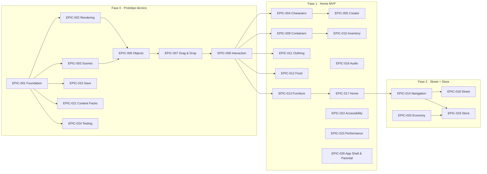

# Epics

> **Status:** Accepted (v1) · **Last Updated:** 2026-09-18
> **Relacionado:** [BACKLOG.md](BACKLOG.md) · [MVP_USER_STORIES.md](MVP_USER_STORIES.md) · [../TRACEABILITY.md](../TRACEABILITY.md) · [../product/ROADMAP.md](../product/ROADMAP.md)

Este documento es la **lista maestra** de Epics e historias de usuario (HU). Si un ID no aparece aquí, no existe.

## Reglas de numeración

| Rango | Significado |
|---|---|
| `HU-GAME-001` … `HU-GAME-099` | Alcance **MVP** (Fases 0, 1 y 2). El detalle completo está en [mvp/](mvp/). |
| `HU-GAME-100` … `HU-GAME-199` | **POST-MVP**. Se describen en [POST_MVP_STORIES.md](POST_MVP_STORIES.md). |
| `HU-GAME-200` … `HU-GAME-299` | **FUTURE** (ideas validadas, sin diseño detallado). Se describen en [POST_MVP_STORIES.md](POST_MVP_STORIES.md). |

- Los IDs **nunca se reutilizan**. Si una HU se descarta, se marca como `Dropped` y su número queda sin usar.
- Una HU nueva toma el siguiente número libre de su rango.

**Prioridad** (solo MVP):
- **P0:** sin esto no hay juego.
- **P1:** necesario para lanzar el MVP.
- **P2:** deseable dentro del MVP. Se puede recortar.

**MoSCoW:** Must, Should o Could, como aparece en cada HU.

---

## Vista general

---

## Catálogo de Epics

| Epic | Nombre | Objetivo | Fase | Alcance | Docs principales |
|---|---|---|---|---|---|
| EPIC-001 | Game Foundation | Proyecto base, núcleo del World y puente con la UI | 0 | MVP | [GAME_ENGINE](../architecture/GAME_ENGINE.md), [ECS](../architecture/ECS.md) |
| EPIC-002 | Rendering Engine | Dibujar el mundo con Skia en resolución virtual | 0 | MVP | [RENDERING](../architecture/RENDERING.md) |
| EPIC-003 | Scene Management | Escenas declaradas por datos | 0 | MVP | [SCENE_SYSTEM](../architecture/SCENE_SYSTEM.md), [SCENE_SCHEMA](../data/SCENE_SCHEMA.md) |
| EPIC-004 | Character System | Personajes por capas, poses y manos | 1 | MVP | [CHARACTER_SYSTEM](../architecture/CHARACTER_SYSTEM.md) |
| EPIC-005 | Character Creator | Crear y editar personajes | 1 | MVP | [CHARACTER_SCHEMA](../data/CHARACTER_SCHEMA.md) |
| EPIC-006 | Object System | Prefabs, estados, hitboxes | 0 | MVP | [OBJECT_SCHEMA](../data/OBJECT_SCHEMA.md) |
| EPIC-007 | Drag & Drop | Arrastrar y soltar con superficies | 0 | MVP | [INPUT_SYSTEM](../architecture/INPUT_SYSTEM.md) |
| EPIC-008 | Interaction System | Interacciones resueltas por reglas de datos | 0 | MVP | [INTERACTION_SYSTEM](../architecture/INTERACTION_SYSTEM.md) |
| EPIC-009 | Containers | Abrir, cerrar, guardar y sacar objetos | 1 | MVP | [INVENTORY_SYSTEM](../architecture/INVENTORY_SYSTEM.md) |
| EPIC-010 | Inventory | Mochila global entre escenas | 1 | MVP | [INVENTORY_SYSTEM](../architecture/INVENTORY_SYSTEM.md) |
| EPIC-011 | Clothing | Vestir y quitar prendas | 1 | MVP | [CHARACTER_SYSTEM](../architecture/CHARACTER_SYSTEM.md) |
| EPIC-012 | Food & Drinks | Comer, beber y reponer comida | 1 | MVP | [INTERACTION_SYSTEM](../architecture/INTERACTION_SYSTEM.md) |
| EPIC-013 | Furniture | Sentarse, dormir, encender, mover muebles | 1 | MVP | [INTERACTION_SYSTEM](../architecture/INTERACTION_SYSTEM.md) |
| EPIC-014 | Scene Navigation | Puertas, transiciones y mapa | 2 | MVP | [SCENE_SYSTEM](../architecture/SCENE_SYSTEM.md) |
| EPIC-015 | Save System | Persistencia offline con migraciones | 0 | MVP | [SAVE_SYSTEM](../architecture/SAVE_SYSTEM.md), [SAVE_SCHEMA](../data/SAVE_SCHEMA.md) |
| EPIC-016 | Audio | Efectos de sonido, música y volumen | 1 | MVP | [AUDIO_SYSTEM](../architecture/AUDIO_SYSTEM.md) |
| EPIC-017 | Home | Contenido: salón, cocina, dormitorio, baño | 1 | MVP | [ENVIRONMENT_GUIDELINES](../design/ENVIRONMENT_GUIDELINES.md) |
| EPIC-018 | Street | Contenido: calle | 2 | MVP | [ENVIRONMENT_GUIDELINES](../design/ENVIRONMENT_GUIDELINES.md) |
| EPIC-019 | Store | Contenido: tienda | 2 | MVP | [ENVIRONMENT_GUIDELINES](../design/ENVIRONMENT_GUIDELINES.md) |
| EPIC-020 | Economy | Monedas y compras | 2 | MVP | [GAME_RULES](../product/GAME_RULES.md) |
| EPIC-021 | Content Packs | El contenido como paquetes con namespace | 0 | MVP (solo el pack core) | [CONTENT_SYSTEM](../architecture/CONTENT_SYSTEM.md) |
| EPIC-022 | Accessibility | Jugable sin leer y con objetivos táctiles grandes | 1 | MVP | [UI_UX_GUIDELINES](../design/UI_UX_GUIDELINES.md) |
| EPIC-023 | Performance | Presupuestos medidos en dispositivos reales | 1 | MVP | [PERFORMANCE](../architecture/PERFORMANCE.md) |
| EPIC-024 | Testing | Harness headless y validación de contenido | 0 | MVP | [CODING_GUIDELINES](../ai/CODING_GUIDELINES.md) |
| EPIC-025 | Analytics | Métricas que respetan la privacidad infantil | — | POST-MVP | [MONETIZATION](../product/MONETIZATION.md) |
| EPIC-026 | App Shell & Parental | Pantalla de inicio, ajustes y puerta parental | 1 | MVP | [UI_UX_GUIDELINES](../design/UI_UX_GUIDELINES.md) |
| EPIC-027 | NPCs | Personajes no jugables con comportamientos simples | 3 | POST-MVP | [CHARACTER_SYSTEM](../architecture/CHARACTER_SYSTEM.md) |
| EPIC-028 | Pets | Mascotas | 4 | POST-MVP | [GAME_VISION](../product/GAME_VISION.md) |
| EPIC-029 | Memories | Álbum de recuerdos (diferenciador) | 3 | POST-MVP | [GAME_VISION](../product/GAME_VISION.md) |
| EPIC-030 | Crafting & Combining | Objetos combinables (diferenciador) | 3 | POST-MVP | [INTERACTION_SYSTEM](../architecture/INTERACTION_SYSTEM.md) |
| EPIC-031 | Secrets | Pequeños secretos descubribles | 3 | POST-MVP | [GAME_DESIGN_DOCUMENT](../product/GAME_DESIGN_DOCUMENT.md) |
| EPIC-032 | Player Businesses | Negocios creados por el jugador | 6 | POST-MVP | [GAME_VISION](../product/GAME_VISION.md) |
| EPIC-033 | Cloud & Backend | Guardado en la nube (.NET 8 + PostgreSQL) | 8 | FUTURE | [BACKEND_FUTURE](../architecture/BACKEND_FUTURE.md) |
| EPIC-034 | Decoration | Paredes, suelos y decoración libre | 3 | POST-MVP | [ENVIRONMENT_GUIDELINES](../design/ENVIRONMENT_GUIDELINES.md) |

---

## Lista maestra de HU del MVP

Leyenda de las columnas:
- **Fase:** fase del [ROADMAP](../product/ROADMAP.md).
- **Deps:** HU de las que depende.
- **Archivo:** dónde está el detalle completo.

### EPIC-001 Game Foundation → [mvp/EPIC-001-foundation.md](mvp/EPIC-001-foundation.md)
| ID | Título | Prio | Fase | Deps |
|---|---|---|---|---|
| HU-GAME-001 | Configurar el proyecto Expo para el juego | Must · P0 | 0 | — |
| HU-GAME-002 | Configurar pruebas unitarias y harness headless | Must · P0 | 0 | 001 |

> HU-GAME-002 entrega Jest y las utilidades del harness (reloj falso, `random` sembrado, `InMemorySaveStore`, builders de fixtures) y un `createTestGame` **mínimo** (un World vacío). HU-GAME-003 lo amplía cuando existe el World real. Así no hay dependencia circular.

| HU-GAME-003 | Núcleo del World: entidades, componentes y eventos | Must · P0 | 0 | 001, 002 |
| HU-GAME-004 | GameFacade: puente UI ↔ motor | Must · P0 | 0 | 003 |

### EPIC-002 Rendering Engine → [mvp/EPIC-002-rendering.md](mvp/EPIC-002-rendering.md)
| ID | Título | Prio | Fase | Deps |
|---|---|---|---|---|
| HU-GAME-005 | Canvas Skia con resolución virtual | Must · P0 | 0 | 001 |
| HU-GAME-006 | Renderizar entidades por capas y orden z | Must · P0 | 0 | 003, 005 |
| HU-GAME-007 | Cámara horizontal con paneo | Must · P0 | 0 | 005 |
| HU-GAME-008 | Culling y carga de fondos por chunks | Should · P1 | 1 | 006, 007 |
| HU-GAME-009 | Tweens y animaciones simples | Should · P1 | 1 | 006 |

### EPIC-003 Scene Management → [mvp/EPIC-003-scenes.md](mvp/EPIC-003-scenes.md)
| ID | Título | Prio | Fase | Deps |
|---|---|---|---|---|
| HU-GAME-010 | Cargar una escena declarada en JSON | Must · P0 | 0 | 003, 068 |
| HU-GAME-011 | Instanciar entidades desde prefabs con overrides | Must · P0 | 0 | 010, 024 |
| HU-GAME-012 | Zonas (habitaciones) dentro de una escena | Should · P1 | 1 | 010 |

### EPIC-004 Character System → [mvp/EPIC-004-characters.md](mvp/EPIC-004-characters.md)
| ID | Título | Prio | Fase | Deps |
|---|---|---|---|---|
| HU-GAME-013 | Renderizar un personaje por capas | Must · P0 | 1 | 006 |
| HU-GAME-014 | Poses del personaje | Must · P0 | 1 | 013 |
| HU-GAME-015 | Expresiones faciales | Should · P1 | 1 | 013 |
| HU-GAME-016 | Sostener objetos en las manos | Must · P0 | 1 | 014, 031 |
| HU-GAME-017 | Arrastrar personajes | Must · P0 | 1 | 014, 027 |

### EPIC-005 Character Creator → [mvp/EPIC-005-creator.md](mvp/EPIC-005-creator.md)
| ID | Título | Prio | Fase | Deps |
|---|---|---|---|---|
| HU-GAME-018 | Abrir el creador y elegir cuerpo y tono de piel | Must · P0 | 1 | 013, 004 |
| HU-GAME-019 | Elegir ojos y boca | Must · P0 | 1 | 018 |
| HU-GAME-020 | Elegir peinado y color de pelo | Must · P0 | 1 | 018 |
| HU-GAME-021 | Elegir ropa inicial | Must · P0 | 1 | 018 |
| HU-GAME-022 | Guardar, listar y editar personajes | Must · P0 | 1 | 018, 052 |
| HU-GAME-023 | Colocar personajes creados en el mundo | Must · P0 | 1 | 022, 010 |

### EPIC-006 Object System → [mvp/EPIC-006-objects.md](mvp/EPIC-006-objects.md)
| ID | Título | Prio | Fase | Deps |
|---|---|---|---|---|
| HU-GAME-024 | Registro de prefabs de objetos con validación | Must · P0 | 0 | 003, 068 |
| HU-GAME-025 | Estados de objetos y sprites por estado | Must · P0 | 0 | 024, 006 |
| HU-GAME-026 | Hitbox y hit testing | Must · P0 | 0 | 024, 007 |

### EPIC-007 Drag & Drop → [mvp/EPIC-007-drag-drop.md](mvp/EPIC-007-drag-drop.md)
| ID | Título | Prio | Fase | Deps |
|---|---|---|---|---|
| HU-GAME-027 | Arrastrar objetos | Must · P0 | 0 | 026 |
| HU-GAME-028 | Soltar objetos sobre superficies y el suelo | Must · P0 | 0 | 027 |
| HU-GAME-029 | Auto-scroll de la cámara al arrastrar cerca del borde | Must · P1 | 1 | 027, 007 |
| HU-GAME-030 | Los objetos apoyados se mueven con su mueble | Could · P2 | 1 | 028, 048 |

### EPIC-008 Interaction System → [mvp/EPIC-008-interaction.md](mvp/EPIC-008-interaction.md)
| ID | Título | Prio | Fase | Deps |
|---|---|---|---|---|
| HU-GAME-031 | Resolver interacciones mediante reglas de datos | Must · P0 | 0 | 028 |
| HU-GAME-032 | Interacciones por tap | Must · P0 | 0 | 026, 031 |
| HU-GAME-033 | Resaltar el destino válido durante el arrastre | Should · P1 | 1 | 031 |

### EPIC-009 Containers → [mvp/EPIC-009-containers.md](mvp/EPIC-009-containers.md)
| ID | Título | Prio | Fase | Deps |
|---|---|---|---|---|
| HU-GAME-034 | Abrir y cerrar muebles | Must · P0 | 1 | 025, 032 |
| HU-GAME-035 | Guardar objetos en contenedores | Must · P0 | 1 | 034, 031 |
| HU-GAME-036 | Sacar objetos de contenedores | Must · P0 | 1 | 035 |

### EPIC-010 Inventory → [mvp/EPIC-010-inventory.md](mvp/EPIC-010-inventory.md)
| ID | Título | Prio | Fase | Deps |
|---|---|---|---|---|
| HU-GAME-037 | Guardar objetos en la mochila | Should · P1 | 1 | 031, 004 |
| HU-GAME-038 | Sacar objetos de la mochila | Should · P1 | 1 | 037 |

### EPIC-011 Clothing → [mvp/EPIC-011-clothing.md](mvp/EPIC-011-clothing.md)
| ID | Título | Prio | Fase | Deps |
|---|---|---|---|---|
| HU-GAME-039 | Vestir prendas soltándolas sobre el personaje | Must · P0 | 1 | 013, 031 |
| HU-GAME-040 | Quitar prendas del personaje | Should · P1 | 1 | 039 |
| HU-GAME-041 | Armario con ropa disponible | Should · P1 | 1 | 035, 039 |

### EPIC-012 Food & Drinks → [mvp/EPIC-012-food.md](mvp/EPIC-012-food.md)
| ID | Título | Prio | Fase | Deps |
|---|---|---|---|---|
| HU-GAME-042 | Comer alimentos por mordiscos | Must · P0 | 1 | 031, 014, 025 |
| HU-GAME-043 | Beber bebidas | Must · P0 | 1 | 042 |
| HU-GAME-044 | Dispensadores de objetos | Should · P1 | 1 | 032, 024 |

### EPIC-013 Furniture → [mvp/EPIC-013-furniture.md](mvp/EPIC-013-furniture.md)
| ID | Título | Prio | Fase | Deps |
|---|---|---|---|---|
| HU-GAME-045 | Sentarse en asientos | Must · P0 | 1 | 017, 031 |
| HU-GAME-046 | Dormir en camas | Must · P0 | 1 | 045 |
| HU-GAME-047 | Objetos encendibles (lámpara, TV, grifo) | Should · P1 | 1 | 032, 025 |
| HU-GAME-048 | Mover muebles | Should · P1 | 1 | 027, 028 |

### EPIC-014 Scene Navigation → [mvp/EPIC-014-navigation.md](mvp/EPIC-014-navigation.md)
| ID | Título | Prio | Fase | Deps |
|---|---|---|---|---|
| HU-GAME-049 | Puertas y portales entre escenas | Must · P0 | 2 | 010, 031, 017 |
| HU-GAME-050 | Transición entre escenas | Must · P0 | 2 | 049 |
| HU-GAME-051 | Mapa de ubicaciones | Should · P1 | 2 | 050 |

### EPIC-015 Save System → [mvp/EPIC-015-save.md](mvp/EPIC-015-save.md)
| ID | Título | Prio | Fase | Deps |
|---|---|---|---|---|
| HU-GAME-052 | Autoguardado del mundo en SQLite | Must · P0 | 0 | 003, 011 |
| HU-GAME-053 | Restaurar la partida al iniciar | Must · P0 | 0 | 052 |
| HU-GAME-054 | Versionado y migraciones de guardado | Must · P0 | 0 | 052 |
| HU-GAME-055 | Reiniciar el mundo | Could · P2 | 1 | 053, 074 |

### EPIC-016 Audio → [mvp/EPIC-016-audio.md](mvp/EPIC-016-audio.md)
| ID | Título | Prio | Fase | Deps |
|---|---|---|---|---|
| HU-GAME-056 | Sonidos de interacción | Should · P1 | 1 | 031 |
| HU-GAME-057 | Música y ambiente por ubicación | Should · P1 | 1 | 012 |
| HU-GAME-058 | Control de volumen y silencio | Must · P1 | 1 | 056, 075 |

### EPIC-017 Home → [mvp/EPIC-017-home.md](mvp/EPIC-017-home.md)
| ID | Título | Prio | Fase | Deps |
|---|---|---|---|---|
| HU-GAME-059 | Salón jugable | Must · P0 | 1 | 012, 034, 035, 045, 047 |
| HU-GAME-060 | Cocina jugable | Must · P0 | 1 | 035, 042, 043, 044, 045, 047 |
| HU-GAME-061 | Dormitorio jugable | Must · P0 | 1 | 041, 046, 047 |
| HU-GAME-062 | Baño jugable | Should · P1 | 1 | 035, 045, 047 |

### EPIC-018 Street → [mvp/EPIC-018-street.md](mvp/EPIC-018-street.md)
| ID | Título | Prio | Fase | Deps |
|---|---|---|---|---|
| HU-GAME-063 | Calle jugable | Must · P1 | 2 | 008, 035, 045, 047, 049 |

### EPIC-019 Store → [mvp/EPIC-019-store.md](mvp/EPIC-019-store.md)
| ID | Título | Prio | Fase | Deps |
|---|---|---|---|---|
| HU-GAME-064 | Tienda jugable | Must · P1 | 2 | 035, 049, 066 |

### EPIC-020 Economy → [mvp/EPIC-020-economy.md](mvp/EPIC-020-economy.md)
| ID | Título | Prio | Fase | Deps |
|---|---|---|---|---|
| HU-GAME-065 | Monedero de monedas | Must · P1 | 2 | 052, 004 |
| HU-GAME-066 | Comprar objetos | Must · P1 | 2 | 065, 031 |
| HU-GAME-067 | Regalo diario y monedas escondidas | Could · P2 | 2 | 065, 032 |

### EPIC-021 Content Packs → [mvp/EPIC-021-content.md](mvp/EPIC-021-content.md)
| ID | Título | Prio | Fase | Deps |
|---|---|---|---|---|
| HU-GAME-068 | Pack "core" con manifest y namespaces | Must · P0 | 0 | 003 |

### EPIC-022 Accessibility → [mvp/EPIC-022-accessibility.md](mvp/EPIC-022-accessibility.md)
| ID | Título | Prio | Fase | Deps |
|---|---|---|---|---|
| HU-GAME-070 | Objetivos táctiles grandes y UI sin texto | Must · P1 | 1 | 004 |

### EPIC-023 Performance → [mvp/EPIC-023-performance.md](mvp/EPIC-023-performance.md)
| ID | Título | Prio | Fase | Deps |
|---|---|---|---|---|
| HU-GAME-071 | Overlay de rendimiento y verificación de presupuestos | Must · P1 | 1 | 006 |

### EPIC-024 Testing → [mvp/EPIC-024-testing.md](mvp/EPIC-024-testing.md)
| ID | Título | Prio | Fase | Deps |
|---|---|---|---|---|
| HU-GAME-069 | Validador de contenido para la CLI y la CI | Must · P0 | 0 | 068, 002 |
| HU-GAME-072 | Pruebas de regresión de guardado con fixtures | Should · P1 | 1 | 054 |

### EPIC-026 App Shell & Parental → [mvp/EPIC-026-app-shell.md](mvp/EPIC-026-app-shell.md)
| ID | Título | Prio | Fase | Deps |
|---|---|---|---|---|
| HU-GAME-073 | Pantalla de inicio | Must · P0 | 1 | 004, 053 |
| HU-GAME-074 | Puerta parental | Must · P1 | 1 | 073 |
| HU-GAME-075 | Pantalla de ajustes | Must · P1 | 1 | 074 |

**Total del MVP: 75 HU** (HU-GAME-001 a HU-GAME-075).

**Las HU de POST-MVP y FUTURE** (HU-GAME-100 en adelante) están en [POST_MVP_STORIES.md](POST_MVP_STORIES.md).
